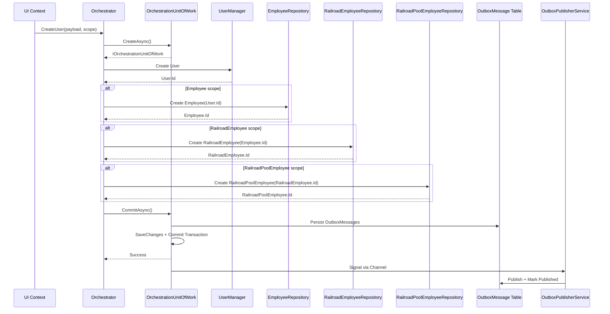

# CrewService Solution

CrewService is a modular .NET 10 gRPC-based microservice for crew and employee management. The host project groups logical layers and domain modules to simplify deployment, transactionality, and consistent bootstrapping.

## Table of Contents

- [Summary](#summary)
- [Quickstart](#quickstart)
- [Overview](#overview)
- [Repository layout](#repository-layout)
- [UI context — creation mapping](#ui-context---creation-mapping)
- [Orchestration Unit of Work (UoW)](#orchestration-unit-of-work-uow)
- [Domain events & Outbox](#domain-events--outbox)
- [Sequence diagram](#sequence-diagram)
- [Development notes](#development-notes)
- [Testing](#testing)
- [Contributing](#contributing)
- [License](#license)

---

## Summary

- **Targets:** .NET 10, C# 14  
- **Purpose:** Provide gRPC endpoints (with JSON transcoding), a clean layered structure for domain-driven design, and a short‑lived orchestration UoW for atomic multi-context flows with Outbox-based event publishing.

## Quickstart

**Prerequisites:**

- [.NET 10 SDK](https://dotnet.microsoft.com/download/dotnet/10.0)  
- Visual Studio 2026 (recommended)  
- Database (SQLite for dev, SQL Server for prod)

**Steps:**

1. Clone: `git clone https://github.com/ddmccrory/CrewService.git`
2. Restore packages: `dotnet restore`
3. Configure secrets (JWT, connection strings via User Secrets)
4. Run migrations and start: `dotnet run --project CrewService.API/CrewService.GrpcService`

## Overview

**Core goals:**

- Expose gRPC endpoints with JSON transcoding for REST compatibility
- Use a clean, layered organization for domain-driven development
- Support multiple creation scopes driven by UI context (Users, Employees, Railroad, Railroad Pool)
- Reliable domain event publishing via Outbox pattern

## Repository layout

```
CrewService/
├── CrewService.API/                    # API host and layers
│   ├── CrewService.GrpcService/        # Host entry point, gRPC-Web, Swagger
│   ├── CrewService.Application/        # Use cases, application services (placeholder)
│   ├── CrewService.Domain/             # Aggregates, value objects, domain events
│   │   ├── DomainEvents/               # DomainEvent base record
│   │   ├── Interfaces/                 # IOrchestrationUnitOfWork, repositories
│   │   ├── Models/                     # Employees, Railroads, Seniority entities
│   │   └── Outbox/                     # OutboxMessage, OutboxMessageStatus
│   ├── CrewService.Infrastructure/     # Adapters, Identity User, Outbox publisher
│   │   └── Outbox/                     # OutboxPublisherService, OutboxDispatcher
│   ├── CrewService.Persistance/        # EF Core DbContexts, migrations, repositories
│   │   ├── Data/                       # CrewServiceDbContext, UserAccessDbContext
│   │   ├── Repositories/               # Entity repositories
│   │   └── UnitOfWork/                 # OrchestrationUnitOfWork, Factory
│   └── CrewService.Presentation/       # gRPC service implementations
├── CrewService.FrontEnd/               # Blazor UI (BlazorUI project)
├── docs/                               # Diagrams and supporting documentation
└── tests/                              # Unit and integration tests
```

**Rationale:** Grouping Domain, Infrastructure, Persistence, Presentation, and GrpcService under the API host simplifies achieving a single transactional boundary and consistent bootstrapping.

## UI context — creation mapping

The active UI determines which entities to create:

| UI Context        | Entities Created                                        |
|-------------------|---------------------------------------------------------|
| Users UI          | `User` only                                             |
| Employees UI      | `User` + `Employee`                                     |
| Railroad UI       | `User` + `Employee` + `RailroadEmployee`                |
| Railroad Pool UI  | `User` + `Employee` + `RailroadEmployee` + `RailroadPoolEmployee` |

The orchestrator accepts a composite payload or explicit scope flag and creates only the required entities.

## Orchestration Unit of Work (UoW)

**Purpose:** Provide a short-lived orchestration UoW that creates a single shared `DbConnection` + `DbTransaction` and instantiates one or both DbContexts:

- `UserAccessDbContext` (Identity / `User`)
- `CrewServiceDbContext` (domain entities)

**Components:**

| Component                          | Location                                    | Description                                    |
|------------------------------------|---------------------------------------------|------------------------------------------------|
| `IOrchestrationUnitOfWork`         | Domain/Interfaces                           | Interface exposing all repositories + commit/rollback |
| `IOrchestrationUnitOfWorkFactory`  | Domain/Interfaces                           | Factory interface for creating UoW instances   |
| `OrchestrationUnitOfWork`          | Persistance/UnitOfWork                      | Concrete implementation with transaction mgmt  |
| `OrchestrationUnitOfWorkFactory`   | Persistance/UnitOfWork                      | Creates dedicated connection/transaction per UoW |

**Repositories exposed by UoW:**

- **Core:** `Employees`, `RailroadEmployees`, `RailroadPoolEmployees`, `Railroads`, `RailroadPools`, `Parents`
- **Contact Types:** `AddressTypes`, `PhoneNumberTypes`, `EmailAddressTypes`
- **Employment:** `EmploymentStatuses`, `EmploymentStatusHistory`, `EmployeePriorServiceCredits`
- **Seniority:** `Crafts`, `Rosters`, `Seniority`, `SeniorityStates`

**DI Registration:**

- `IOrchestrationUnitOfWorkFactory` registered as **transient** (creates new UoW per request)
- Existing scoped `DbContext` registrations remain for non-orchestration flows
- Repositories accept context via constructor

**Safety rules:**

- Use single explicit `DbTransaction` on one opened connection to avoid MSDTC promotions
- Call `SaveChanges()` to obtain IDs before creating dependent entities (still inside the same transaction)
- Never pass EF entity instances across DbContexts; pass IDs only
- Keep transaction lifetime minimal; avoid long-running I/O inside transaction boundaries

**Migrations & schema:**

- Ensure `Employee.UserId -> User.Id` FK exists and migrations are coordinated
- Prefer explicit cascade behavior (recommend `Restrict` for explicit deletes)

**Observability & safety:**

- Make orchestration idempotent (idempotency key or unique constraints)
- Add correlation IDs to logs for each orchestration
- Provide integration tests for success and failure paths

## Domain events & Outbox

**Domain Event envelope** (`DomainEvent` base record in `Domain/DomainEvents`):

| Field             | Type       | Description                              |
|-------------------|------------|------------------------------------------|
| `EventId`         | `Guid`     | Unique event identifier                  |
| `EventType`       | `string`   | Concrete event type name                 |
| `AggregateType`   | `string`   | Aggregate root type                      |
| `AggregateId`     | `long`     | Aggregate identifier                     |
| `OccurredAt`      | `DateTime` | UTC timestamp                            |
| `CorrelationId`   | `string?`  | Request correlation (optional)           |
| `OrchestrationId` | `string?`  | Groups related events in a flow          |
| `IdempotencyKey`  | `string?`  | Deduplication key (optional)             |
| `EventVersion`    | `int`      | Schema version (default: 1)              |
| `PayloadJson`     | `string?`  | Minimal JSON payload (camelCase)         |

**Outbox components:**

| Component               | Location              | Description                                      |
|-------------------------|-----------------------|--------------------------------------------------|
| `OutboxMessage`         | Domain/Outbox         | Entity persisted in same transaction as aggregate |
| `OutboxMessageStatus`   | Domain/Outbox         | Enum: Pending, Published, Failed                 |
| `OutboxDispatcher`      | Infrastructure/Outbox | In-process Channel for immediate dispatch        |
| `OutboxPublisherService`| Infrastructure/Outbox | Hybrid BackgroundService (channel + polling)     |
| `IMessagePublisher`     | Domain/Interfaces     | Abstraction for publishing (NoOp in dev)         |

**Flow:**

1. Orchestration UoW collects domain events from aggregates
2. On `CommitAsync()`, events are converted to `OutboxMessage` rows and persisted in the same transaction
3. After commit, `OutboxDispatcher` signals the background publisher via Channel
4. `OutboxPublisherService` publishes immediately (channel) or polls for missed messages (fallback)

**Guidance:**

- Keep payloads minimal: IDs, non-PII keys, changed-fields map, or snapshot reference
- Do not publish inside aggregates/repositories—UoW handles Outbox persistence
- Use `CorrelationId`/`OrchestrationId` so consumers can reconstruct composite operations
- Avoid embedding PII in payloads; include references only

## Sequence diagram



## Development notes

- **Separate DbContexts:** `UserAccessDbContext` (Identity) and `CrewServiceDbContext` (domain)
- **Cross-context transactions:** Same DB/connection—share `DbConnection`/`DbTransaction` via UoW
- **Different DBs:** Use Outbox + message broker or saga for eventual consistency
- **Uniqueness:** Enforce DB uniqueness (email, employee number); make create operations idempotent
- **PII:** Treat as sensitive; encrypt at rest, avoid returning in responses
- **Roles/Claims:** Assign within the same transactional boundary if dependent on domain entities

**Configuration (appsettings.json / User Secrets):**

```json
{
  "ConnectionStrings": {
    "SQLiteConnection": "Data Source=crewservice.db"
  },
  "Jwt": {
    "Key": "<your-secret-key>",
    "Issuer": "<issuer>",
    "Audience": "<audience>"
  },
  "OutboxPublisher": {
    "Enabled": true,
    "PollingInterval": "00:00:30",
    "BatchSize": 100,
    "RetentionDays": 7
  }
}
```

## Testing

**Recommended integration tests:**

- User-only creation
- User → Employee
- User → Employee → RailroadEmployee
- Full path (User → Employee → RailroadEmployee → RailroadPoolEmployee)
- Simulated failures at each step to verify rollback
- Idempotency/retry behavior
- Outbox publishing and message delivery

## Contributing

Fork, create a feature branch, add tests for behavior changes, and open a pull request.

## License

MIT — see `LICENSE` in repository root.

