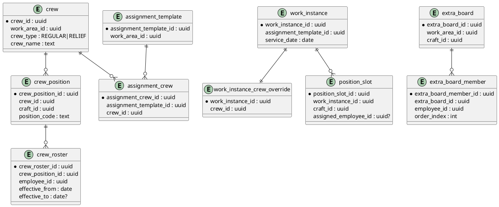

# SPEC-4-Crew and Assignment Staffing Model

## Background

This spec extends the existing platform foundation (Dynamic Groups + WorkAreas + Assignment Templates/WorkInstances + Position Slots + Employees/Boards) to support **explicit crew constructs**:

- Build a tenant-defined **railroad hierarchy** down to **WorkAreas**.
- Define **Assignment Templates** with a baseline staffing plan.
- Define **Crews** (regular and relief) that can be attached to assignments.
- Define **positions** within crews and assign **employees to positions**.
- Support **extra board positions** used to supply/cover vacancies.

This is aligned with the scope document’s principles that:
- Work is modeled as **Assignment Templates** and day-specific **WorkInstances**.
- Staffing demand is modeled as **Position Slots** (craft-specific), and a “crew” is the filled set of those slots.

## Requirements

### Must Have

- **[CS-001] Hierarchy to WorkArea**: Admin can create the Dynamic Group tree down to **WorkAreas** (e.g., Railroad → Division → Terminal/Yard), and WorkAreas are the attachment point for work.
- **[CS-002] Assignment Templates with baseline staffing**: Admin/Dispatcher can create Assignment Templates scoped to a WorkArea with a **minimum/base crew composition** expressed as position definitions (craft + role/position).
- **[CS-003] WorkInstances generate position slots**: For each WorkInstance (generated or ad-hoc), generate **position slots** from baseline staffing plus any recurring/one-off extras.
- **[CS-004] Regular Crews as fixed rosters**:
  - A **Regular Crew** is a named group of positions for a job (e.g., Job A) with a **fixed incumbent employee per position** (Engineer = Employee X, Conductor/Switchman = Employee Y).
  - Regular crews are expected to staff the same job/positions **each day they run**, unless explicitly overridden.
- **[CS-005] Relief Crews as fixed rosters**:
  - A **Relief Crew** is a named group of positions (e.g., Relief Job 1: 1 Engineer + 2 Switchmen) with fixed incumbents per position.
  - Relief crew coverage may be configured by a **schedule/pattern** or by **instance-level selection**.
- **[CS-006] Attach crews to work**:
  - Assign a Regular Crew to an Assignment Template (default) and/or to specific WorkInstances (override).
  - Assign a Relief Crew to one or more Assignment Templates/WorkInstances that it covers.
- **[CS-007] Position-to-employee binding**:
  - A WorkInstance’s position slot can be **bound** to a specific employee (prefill from crew roster, or manual assignment).
  - Prevent double-booking: once assigned, an employee is ineligible for overlapping slots.
- **[CS-008] Extra boards fill vacancies by craft**:
  - Configure **Extra Boards** (craft-specific, ordered lists) and associate them to WorkAreas via precedence/cascade policy.
  - Open/unfilled position slots are filled by the applicable **craft extra board**.
- **[CS-009] CRUD + audit**: All creates/updates (crews, rosters, assignments, bindings) are auditable.

### Should Have

- **[CS-101] Effective-dated roster changes**: future-dated changes to crew incumbents by position.
- **[CS-102] Overrides with traceability**: WorkInstance overrides (crew change, extra positions, reassignment) capture who/when/why.

### Could Have

- **[CS-201] Reusable crew templates**: same crew definition can be reused across assignments with scoped overrides.

### Won’t Have (Now)

- **[CS-301] Auto-optimization**: no automatic crew construction/optimization beyond board-based calling.

## Method

### Core Concepts

- **Dynamic Group Hierarchy → WorkArea**: WorkAreas are leaves in the hierarchy and are where work is planned and staffed.
- **AssignmentTemplate**: defines *what the job is* and *when it runs* (recurrence), plus its baseline staffing positions.
- **WorkInstance**: a dated instance of an AssignmentTemplate (or ad-hoc assignment) that must be staffed.
- **PositionSlot**: the smallest unit of staffing demand; a WorkInstance has N PositionSlots.
- **Crew**: a *fixed roster* (group of positions with incumbents) that is attached to an AssignmentTemplate (default) and/or a WorkInstance (override).
- **ExtraBoard**: craft-specific ordered list of employees used to fill **vacant PositionSlots**.

### Data Model (Relational)

> Assumes existing tables from prior specs: `dynamic_group`, `work_area`, `employee`, `assignment_template`, `work_instance`, `position_slot`, `craft`.

#### 0) Role/position equivalency + qualifications (new)

Goal: allow a PositionSlot to be fillable by **multiple acceptable roles** where agreements define **asymmetric equivalencies** (e.g., a *Switchman* slot may be filled by Switchman **or** Conductor-qualified employees, while a *Conductor* slot may be filled by **Conductor-qualified only**).

- `position_role`
  - `position_role_id` (PK)
  - `role_code` (e.g., 'ENGINEER', 'CONDUCTOR', 'SWITCHMAN')
  - `display_name`
  - `default_craft_id` (FK, nullable)

- `employee_qualification`
  - `employee_qualification_id` (PK)
  - `employee_id` (FK)
  - `position_role_id` (FK)
  - `qualified_from` (date)
  - `qualified_to` (date, nullable)
  - unique (`employee_id`, `position_role_id`, `qualified_from`)

- `slot_requirement`
  - `slot_requirement_id` (PK)
  - `position_slot_id` (FK)
  - `position_role_id` (FK)
  - `craft_id` (FK, nullable)  // when agreements require craft to match
  - `priority` (int)           // 1 = preferred, higher = less preferred
  - unique (`position_slot_id`, `position_role_id`, `craft_id`)

Notes:
- A PositionSlot can have **one or more** SlotRequirements. If there is more than one, the slot is fillable by any requirement, evaluated by `priority`.
- If your agreements treat “Conductor/Switchman” as interchangeable roles under the same craft, set `craft_id` nullable and rely on `employee_qualification`.
- If agreements require strict craft separation, set `craft_id` and resolve boards strictly by craft.

#### 0.5) Rosters (craft seniority lists) (new)

A **Roster** is the authoritative, effective-dated list of employees in a craft, in **seniority/rank order**. Rosters are used for:
- tie-breakers in board ranking (e.g., seniority)
- validating eligibility (some agreements reference roster standing)
- reporting/audit (“why was X ahead of Y?”)

A roster is **not** the same as an Extra Board:
- **Roster** = the full craft seniority list (often everyone in the craft)
- **Extra Board** = a subset/pool used to fill vacancies, whose rotation may be FIFO/call-time/etc.

Data model:

- `craft_roster`
  - `craft_roster_id` (PK)
  - `scope_type` ENUM('SYSTEM','DYNAMIC_GROUP','WORK_AREA')
  - `scope_id` (uuid, nullable) // null when SYSTEM; otherwise points to dynamic_group or work_area
  - `craft_id` (FK)
  - `roster_name`
  - `effective_from` (date)
  - `effective_to` (date, nullable)
  - `source` ENUM('MANUAL','IMPORT')
  - `created_at`, `created_by`

- `craft_roster_member`
  - `craft_roster_member_id` (PK)
  - `craft_roster_id` (FK)
  - `employee_id` (FK)
  - `seniority_date` (date)
  - `seniority_rank` (int)          // 1 = most senior
  - `craft_rank_code` (text, nullable) // agreement-specific (e.g., class)
  - `effective_from` (date)
  - `effective_to` (date, nullable)
  - unique (`craft_roster_id`, `employee_id`, `effective_from`)
  - unique (`craft_roster_id`, `seniority_rank`, `effective_from`)  // prevents duplicates

Integration points:
- Roster resolution is **scoped**:
  - If a WorkInstance is in a WorkArea under a Division/territory (Dynamic Group), resolve the effective roster by:
    1) most specific match first (WORK_AREA)
    2) then DYNAMIC_GROUP (e.g., Division-level)
    3) then SYSTEM (railroad-wide)
  - This supports small railroads (SYSTEM-only) and large railroads (Division/territory rosters).
- `board_member_state.seniority_rank` becomes **derived** from the effective roster (avoid duplication), or stored as a denormalized cache with a refresh job.
- Ranking rule `RANKING_SENIORITY` uses the effective roster for the slot’s craft and scope.
- UI should provide roster views and import, with scope selection and effective dating.

#### Roster resolution query (SQL Server + SQLite)

Assumptions:
- `work_area` has `dynamic_group_id` pointing to the leaf group for that WorkArea.
- `dynamic_group` supports parent linkage via `parent_group_id`.
- `craft_roster` is effective-dated by `effective_from`/`effective_to`.

Inputs: `@work_area_id`, `@craft_id`, `@service_date` (SQL Server) or `:work_area_id`, `:craft_id`, `:service_date` (SQLite)

##### SQL Server (T-SQL)

```sql
;WITH ancestry AS (
  SELECT dg.dynamic_group_id, dg.parent_group_id, 0 AS depth
  FROM work_area wa
  JOIN dynamic_group dg ON dg.dynamic_group_id = wa.dynamic_group_id
  WHERE wa.work_area_id = @work_area_id

  UNION ALL

  SELECT parent.dynamic_group_id, parent.parent_group_id, a.depth + 1
  FROM dynamic_group parent
  JOIN ancestry a ON parent.dynamic_group_id = a.parent_group_id
),
scoped_candidates AS (
  -- 1) WORK_AREA scoped rosters
  SELECT cr.craft_roster_id, 0 AS scope_rank, 0 AS depth
  FROM craft_roster cr
  WHERE cr.craft_id = @craft_id
    AND cr.scope_type = 'WORK_AREA'
    AND cr.scope_id = @work_area_id
    AND cr.effective_from <= @service_date
    AND (cr.effective_to IS NULL OR cr.effective_to >= @service_date)

  UNION ALL

  -- 2) DYNAMIC_GROUP scoped rosters (nearest ancestor wins)
  SELECT cr.craft_roster_id, 1 AS scope_rank, a.depth
  FROM craft_roster cr
  JOIN ancestry a ON cr.scope_type = 'DYNAMIC_GROUP'
                 AND cr.scope_id = a.dynamic_group_id
  WHERE cr.craft_id = @craft_id
    AND cr.effective_from <= @service_date
    AND (cr.effective_to IS NULL OR cr.effective_to >= @service_date)

  UNION ALL

  -- 3) SYSTEM scoped rosters
  SELECT cr.craft_roster_id, 2 AS scope_rank, 2147483647 AS depth
  FROM craft_roster cr
  WHERE cr.craft_id = @craft_id
    AND cr.scope_type = 'SYSTEM'
    AND cr.scope_id IS NULL
    AND cr.effective_from <= @service_date
    AND (cr.effective_to IS NULL OR cr.effective_to >= @service_date)
)
SELECT TOP (1) craft_roster_id
FROM scoped_candidates
ORDER BY scope_rank ASC, depth ASC
OPTION (MAXRECURSION 100);
```

Roster members for ranking:

```sql
SELECT crm.employee_id, crm.seniority_rank, crm.seniority_date
FROM craft_roster_member crm
WHERE crm.craft_roster_id = @craft_roster_id
  AND crm.effective_from <= @service_date
  AND (crm.effective_to IS NULL OR crm.effective_to >= @service_date)
ORDER BY crm.seniority_rank ASC;
```

##### SQLite (dev)

```sql
WITH RECURSIVE ancestry(dynamic_group_id, parent_group_id, depth) AS (
  SELECT dg.dynamic_group_id, dg.parent_group_id, 0
  FROM work_area wa
  JOIN dynamic_group dg ON dg.dynamic_group_id = wa.dynamic_group_id
  WHERE wa.work_area_id = :work_area_id

  UNION ALL

  SELECT parent.dynamic_group_id, parent.parent_group_id, a.depth + 1
  FROM dynamic_group parent
  JOIN ancestry a ON parent.dynamic_group_id = a.parent_group_id
),
scoped_candidates(craft_roster_id, scope_rank, depth) AS (
  SELECT cr.craft_roster_id, 0, 0
  FROM craft_roster cr
  WHERE cr.craft_id = :craft_id
    AND cr.scope_type = 'WORK_AREA'
    AND cr.scope_id = :work_area_id
    AND cr.effective_from <= :service_date
    AND (cr.effective_to IS NULL OR cr.effective_to >= :service_date)

  UNION ALL

  SELECT cr.craft_roster_id, 1, a.depth
  FROM craft_roster cr
  JOIN ancestry a ON cr.scope_type = 'DYNAMIC_GROUP'
                 AND cr.scope_id = a.dynamic_group_id
  WHERE cr.craft_id = :craft_id
    AND cr.effective_from <= :service_date
    AND (cr.effective_to IS NULL OR cr.effective_to >= :service_date)

  UNION ALL

  SELECT cr.craft_roster_id, 2, 2147483647
  FROM craft_roster cr
  WHERE cr.craft_id = :craft_id
    AND cr.scope_type = 'SYSTEM'
    AND cr.scope_id IS NULL
    AND cr.effective_from <= :service_date
    AND (cr.effective_to IS NULL OR cr.effective_to >= :service_date)
)
SELECT craft_roster_id
FROM scoped_candidates
ORDER BY scope_rank ASC, depth ASC
LIMIT 1;
```

Roster members for ranking:

```sql
SELECT crm.employee_id, crm.seniority_rank, crm.seniority_date
FROM craft_roster_member crm
WHERE crm.craft_roster_id = :craft_roster_id
  AND crm.effective_from <= :service_date
  AND (crm.effective_to IS NULL OR crm.effective_to >= :service_date)
ORDER BY crm.seniority_rank ASC;
```

Indexing recommendations:
- SQL Server: create composite nonclustered indexes
  - `craft_roster (craft_id, scope_type, scope_id, effective_from, effective_to) INCLUDE (craft_roster_id)`
  - `craft_roster_member (craft_roster_id, effective_from, effective_to, seniority_rank) INCLUDE (employee_id, seniority_date)`
  - `dynamic_group (dynamic_group_id) INCLUDE (parent_group_id)` (and/or index on parent_group_id if traversing downward elsewhere)
  - `work_area (work_area_id) INCLUDE (dynamic_group_id)`
- SQLite: create covering indexes where beneficial
  - `CREATE INDEX idx_cr_lookup ON craft_roster(craft_id, scope_type, scope_id, effective_from, effective_to);`
  - `CREATE INDEX idx_crm_lookup ON craft_roster_member(craft_roster_id, effective_from, effective_to, seniority_rank);`
  - `CREATE INDEX idx_wa_dg ON work_area(work_area_id, dynamic_group_id);`
  - `CREATE INDEX idx_dg_parent ON dynamic_group(dynamic_group_id, parent_group_id);`

#### 1) Crew definition and roster

- `crew`
  - `crew_id` (PK)
  - `work_area_id` (FK)
  - `crew_type` ENUM('REGULAR','RELIEF')
  - `crew_name` (unique per work_area)
  - `active_from`, `active_to` (nullable)
  - `created_at`, `created_by`, `updated_at`, `updated_by`

- `crew_position`
  - `crew_position_id` (PK)
  - `crew_id` (FK)
  - `position_role_id` (FK)
  - `craft_id` (FK, nullable)
  - `display_name`
  - `sort_order`

- `crew_roster`
  - `crew_roster_id` (PK)
  - `crew_position_id` (FK)
  - `employee_id` (FK)
  - `effective_from` (date)
  - `effective_to` (date, nullable)
  - `is_primary` (bool; default true)
  - `created_at`, `created_by`

Notes:
- A crew position has **one primary incumbent per effective date range**.
- If you later need “backups” or alternates, set `is_primary=false` and keep them as candidates.

#### 2) Attach crews to assignments + relief coverage

- `assignment_crew`
  - `assignment_crew_id` (PK)
  - `assignment_template_id` (FK)
  - `crew_id` (FK)
  - `is_default` (bool)
  - `effective_from` (date)
  - `effective_to` (date, nullable)

- `relief_coverage_rule` (optional but recommended)
  - `relief_coverage_rule_id` (PK)
  - `relief_crew_id` (FK to `crew` where type=RELIEF)
  - `work_area_id` (FK)
  - `day_of_week` (0-6)
  - `covers_assignment_template_id` (FK)
  - `effective_from` (date)
  - `effective_to` (date, nullable)

- `work_instance_crew_override`
  - `work_instance_id` (PK, FK)
  - `crew_id` (FK)
  - `override_reason` (text)
  - `created_at`, `created_by`

#### 3) Position slots and bindings

- `position_slot` (existing; extend as needed)
  - `position_slot_id` (PK)
  - `work_instance_id` (FK)
  - `primary_role_id` (FK to `position_role`, nullable)
  - `status` ENUM('OPEN','ASSIGNED','RELEASED','CANCELLED')
  - `assigned_employee_id` (nullable FK)
  - `assignment_source` ENUM('CREW_PREFILL','MANUAL','EXTRA_BOARD','OTHER')
  - `assigned_at`, `assigned_by`

- `employee_booking` (recommended for fast overlap checks)
  - `booking_id` (PK)
  - `employee_id` (FK)
  - `work_instance_id` (FK)
  - `position_slot_id` (FK)
  - `start_dt`, `end_dt`
  - unique constraint on (`employee_id`, overlapping time window) via exclusion constraint (Postgres) or application check

#### 4) Extra boards (vacancy filling) + rotation policies (extended)

- `extra_board`
  - `extra_board_id` (PK)
  - `work_area_id` (FK)
  - `craft_id` (FK)
  - `board_name`
  - `active_from`, `active_to`

- `extra_board_member`
  - `extra_board_member_id` (PK)
  - `extra_board_id` (FK)
  - `employee_id` (FK)
  - `order_index` (int)                // for FIFO / fixed ordering
  - `last_offered_at` (nullable)       // when dispatcher/caller offered the job
  - `last_assigned_at` (nullable)      // when assignment was accepted/committed
  - `last_called_at` (nullable)        // backward-compat; optional alias of offered/assigned
  - `status` ENUM('ACTIVE','SKIPPED','HELD','INACTIVE')

- `extra_board_rotation_policy`
  - `rotation_policy_id` (PK)
  - `extra_board_id` (FK)
  - `strategy` ENUM('FIFO','CALL_TIME','CUSTOM')
  - `call_time_basis` ENUM('OFFERED','ASSIGNED')   // agreement-specific
  - `tie_breaker` ENUM('SENIORITY','ORDER_INDEX','LAST_ASSIGNED_AT')
  - `custom_rule_ref` (text, nullable) // pointer to ruleset/config name
  - `tie_breaker` ENUM('SENIORITY','ORDER_INDEX','LAST_ASSIGNED_AT')
  - `custom_rule_ref` (text, nullable) // pointer to ruleset/config name

- `board_resolution_policy`
  - `policy_id` (PK)
  - `work_area_id` (FK)
  - `cascade_mode` ENUM('WORKAREA_ONLY','UP_HIERARCHY')
  - `max_levels` (int, nullable)

### Key Workflows

#### A) Create Job A + Crew (fixed roster)

1. Create AssignmentTemplate “Job A” (WorkArea = X) with baseline positions: Engineer(1), Conductor/Switchman(1).
2. Create Crew “Job A Crew” (type=REGULAR) with CrewPositions Engineer, Conductor/Switchman.
3. Add CrewRoster incumbents for each CrewPosition (effective-dated).
4. Attach Crew as default to AssignmentTemplate.

#### B) Generate WorkInstances + Prefill from Crew (with equivalency)

When a WorkInstance is created (from recurrence or ad-hoc):

1. Generate PositionSlots from the AssignmentTemplate baseline.
2. For each PositionSlot, generate `slot_requirement` rows:
   - Always include the primary/declared role.
   - Include any configured equivalents (e.g., Conductor/Switchman) as additional requirements with priorities.
3. Resolve the effective crew for that date:
   - WorkInstance override crew if present; else AssignmentTemplate default crew effective for that date.
4. For each PositionSlot, attempt prefill:
   - Find a CrewPosition whose `position_role_id` matches any SlotRequirement (prefer lowest `priority`).
   - Find primary incumbent in `crew_roster` effective on the WorkInstance date.
   - Validate employee:
  - is qualified for the selected role (`employee_qualification` effective-dated)
  - supports asymmetric equivalency:
    - **CONDUCTOR slot**: only employees qualified for CONDUCTOR
    - **SWITCHMAN slot**: employees qualified for SWITCHMAN **or** CONDUCTOR (modeled via multiple `slot_requirement` rows)
  - satisfies craft constraints if `slot_requirement.craft_id` is set
     - satisfies craft constraints if `slot_requirement.craft_id` is set
     - is available (no overlap bookings)
   - If valid, set `assigned_employee_id`, status=ASSIGNED, source=CREW_PREFILL.
5. Any unfilled slots remain OPEN for board/manual assignment.

#### C) Relief crew coverage

Two supported modes (can coexist):

- **Rule-based**: `relief_coverage_rule` selects which assignment a relief crew covers by day-of-week and effective dates.
- **Dispatcher selection**: dispatcher attaches relief crew to specific WorkInstances via `work_instance_crew_override`.

Prefill logic is identical once the effective crew is determined.

#### D) Fill vacancies from Extra Board (with equivalency + rotation)

For an OPEN PositionSlot:

1. Determine eligible requirements:
   - Read `slot_requirement` for the slot ordered by `priority`.
2. For each requirement (in priority order):
   1) Determine applicable ExtraBoard:
      - If requirement has `craft_id`, resolve board for that craft.
      - Otherwise resolve board for the role’s default craft (or configured craft mapping).
      - Start at WorkArea; if policy allows, walk up hierarchy to find first matching active board.
   2) Determine rotation strategy from `extra_board_rotation_policy`.
      - For CALL_TIME, use `call_time_basis` to decide whether rotation is based on `last_offered_at` or `last_assigned_at`.
   3) Select candidates in the correct order:
      - **FIFO**: ascending `order_index` (then tie-breaker)
      - **CALL_TIME**:
  - If `call_time_basis=OFFERED`: ascending `last_offered_at` nulls-first (then tie-breaker)
  - If `call_time_basis=ASSIGNED`: ascending `last_assigned_at` nulls-first (then tie-breaker)
      - **CUSTOM**: evaluate custom rule (see note below)
   4) Iterate members:
      - Skip non-ACTIVE members.
      - Check qualification for the requirement role + availability.
      - Tentatively assign; re-check overlap; commit assignment.
      - Update rotation fields:
  - FIFO: move the member to bottom (implementation option: increment order_index or use a queue pointer)
  - CALL_TIME:
    - If `call_time_basis=OFFERED`: set `last_offered_at = now()` when the offer is made (even if declined)
    - If `call_time_basis=ASSIGNED`: set `last_assigned_at = now()` only when assignment is accepted/committed
  - Keep `last_called_at` only if needed for backward compatibility; otherwise derive it from the chosen basis
      - Stop after first successful fill.
3. If none of the requirements can be filled, leave OPEN and surface exception.

Custom strategy note (MVP-safe): start with **configurable strategy per board** (FIFO or CALL_TIME). Add CUSTOM as a ruleset that returns an ordered candidate list.

### Ruleset plug-in for agreement-specific logic (recommended next increment)

Some agreements require additional constraints (rest windows, held statuses, skip penalties, seniority tie-breaks, time windows, etc.). Implement this without hard-coding by introducing a **Board Ruleset** abstraction.

#### Data model additions

- `board_ruleset`
  - `ruleset_id` (PK)
  - `work_area_id` (FK)
  - `craft_id` (FK)
  - `ruleset_name`
  - `version` (int)
  - `enabled` (bool)
  - `effective_from` (date)
  - `effective_to` (date, nullable)

- `board_rule`
  - `rule_id` (PK)
  - `ruleset_id` (FK)
  - `rule_type` ENUM(
      'ELIGIBILITY_REST',
      'ELIGIBILITY_TIME_WINDOW',
      'SKIP_POLICY',
      'HOLD_POLICY',
      'RANKING_SENIORITY',
      'RANKING_CALL_TIME',
      'RANKING_FIFO'
    )
  - `params_json` (jsonb)   // contract per rule_type
  - `priority` (int)        // lower runs first
  - `stop_on_fail` (bool)   // for eligibility rules

- `board_member_state`
  - `member_state_id` (PK)
  - `extra_board_member_id` (FK)
  - `held_until` (timestamp, nullable)
  - `rest_until` (timestamp, nullable)
  - `skip_count` (int)
  - `last_skip_at` (timestamp, nullable)
  - `seniority_rank` (int, nullable)

- `board_call_event`
  - `event_id` (PK)
  - `extra_board_id` (FK)
  - `employee_id` (FK)
  - `position_slot_id` (FK)
  - `event_type` ENUM('OFFERED','DECLINED','ACCEPTED','ASSIGNED','SKIPPED','HELD')
  - `event_at` (timestamp)
  - `notes` (text, nullable)

#### Runtime contract

- Implement a small engine:
  - Input: `(extra_board_id, position_slot_id, work_instance_id, now, candidate_members[])`
  - Output: `ordered_candidate_ids[]` + `audit_trace` (why excluded / how ranked)

- Engine stages (deterministic):
  1) **Eligibility filter**: rest/held/time-window/qualification/availability
  2) **Ranking**: FIFO or call-time (basis) plus agreement-specific ranking like seniority
  3) **Post-actions**: update member_state + emit board_call_event depending on OFFER/ACCEPT/DECLINE

#### Example rules

- `ELIGIBILITY_REST`: `{ "min_rest_hours": 10 }` → disqualify if `now < rest_until`.
- `HOLD_POLICY`: `{ "hold_on_decline_hours": 8 }` → set `held_until` after decline.
- `SKIP_POLICY`: `{ "max_skips": 2, "penalty_hours": 4 }` → increment skip_count and hold after threshold.
- `RANKING_SENIORITY`: `{ "direction": "ASC" }` → tie-breaker uses `seniority_rank`.

#### API additions

- `POST /work-areas/{id}/board-rulesets`
- `POST /board-rulesets/{id}/rules`
- `PUT /extra-boards/{id}/rotation-policy` (set `strategy=CUSTOM` and attach `ruleset_id`)
- `GET /extra-boards/{id}/call-events?from=&to=`

### API Surface (minimal)

- Crews
  - `POST /work-areas/{id}/crews`
  - `POST /crews/{id}/positions`
  - `POST /crew-positions/{id}/roster` (effective-dated incumbent)
  - `POST /assignment-templates/{id}/crew` (attach default crew)
  - `POST /work-instances/{id}/crew-override`

- Staffing
  - `POST /work-instances/{id}/position-slots/{slotId}/assign` (manual)
  - `POST /work-instances/{id}/position-slots/{slotId}/fill-from-board`

- Extra Boards
  - `POST /work-areas/{id}/extra-boards`
  - `POST /extra-boards/{id}/members` (ordered)
  - `PUT /board-policies/{workAreaId}`

### PlantUML

#### Component view

```plantuml
@startuml
package "Crew Service" {
  [Hierarchy Service]
  [Assignment Service]
  [Crew Service]
  [Board Service]
}

[Assignment Service] --> [Hierarchy Service] : resolve WorkArea
[Crew Service] --> [Assignment Service] : attach crew to template/instance
[Assignment Service] --> [Crew Service] : prefill slots
[Board Service] --> [Hierarchy Service] : cascade board lookup
[Assignment Service] --> [Board Service] : fill open slots

database "Postgres" as DB
[Hierarchy Service] --> DB
[Assignment Service] --> DB
[Crew Service] --> DB
[Board Service] --> DB
@enduml
```

#### ER sketch



## SQL Server DDL (Production)

Below is a **SQL Server-first** DDL for the new entities introduced in this spec. Types assume:
- primary keys are `uniqueidentifier` (use `newsequentialid()` where desired)
- timestamps are `datetime2(3)`
- enums are stored as `varchar(n)` with CHECK constraints

> Note: Existing tables (`employee`, `craft`, `dynamic_group`, `work_area`, `assignment_template`, `work_instance`, `position_slot`) are referenced via FKs and are not recreated here.

### 1) Roles, qualifications, slot requirements

```sql
CREATE TABLE dbo.position_role (
  position_role_id uniqueidentifier NOT NULL CONSTRAINT PK_position_role PRIMARY KEY,
  role_code varchar(50) NOT NULL CONSTRAINT UQ_position_role_code UNIQUE,
  display_name varchar(100) NOT NULL,
  default_craft_id uniqueidentifier NULL
);

CREATE TABLE dbo.employee_qualification (
  employee_qualification_id uniqueidentifier NOT NULL CONSTRAINT PK_employee_qualification PRIMARY KEY,
  employee_id uniqueidentifier NOT NULL,
  position_role_id uniqueidentifier NOT NULL,
  qualified_from date NOT NULL,
  qualified_to date NULL,
  CONSTRAINT FK_empqual_employee FOREIGN KEY (employee_id) REFERENCES dbo.employee(employee_id),
  CONSTRAINT FK_empqual_role FOREIGN KEY (position_role_id) REFERENCES dbo.position_role(position_role_id)
);

CREATE UNIQUE INDEX UX_empqual_effective
ON dbo.employee_qualification(employee_id, position_role_id, qualified_from);

-- slot_requirement attaches equivalency to a specific slot
CREATE TABLE dbo.slot_requirement (
  slot_requirement_id uniqueidentifier NOT NULL CONSTRAINT PK_slot_requirement PRIMARY KEY,
  position_slot_id uniqueidentifier NOT NULL,
  position_role_id uniqueidentifier NOT NULL,
  craft_id uniqueidentifier NULL,
  priority int NOT NULL,
  CONSTRAINT FK_slotreq_slot FOREIGN KEY (position_slot_id) REFERENCES dbo.position_slot(position_slot_id),
  CONSTRAINT FK_slotreq_role FOREIGN KEY (position_role_id) REFERENCES dbo.position_role(position_role_id),
  CONSTRAINT FK_slotreq_craft FOREIGN KEY (craft_id) REFERENCES dbo.craft(craft_id),
  CONSTRAINT CK_slotreq_priority CHECK (priority >= 1)
);

CREATE UNIQUE INDEX UX_slotreq_unique
ON dbo.slot_requirement(position_slot_id, position_role_id, craft_id);

CREATE INDEX IX_slotreq_slot
ON dbo.slot_requirement(position_slot_id, priority)
INCLUDE (position_role_id, craft_id);
```

### 2) Crews (fixed rosters) and attachment to assignments

```sql
CREATE TABLE dbo.crew (
  crew_id uniqueidentifier NOT NULL CONSTRAINT PK_crew PRIMARY KEY,
  work_area_id uniqueidentifier NOT NULL,
  crew_type varchar(10) NOT NULL,
  crew_name varchar(100) NOT NULL,
  active_from date NULL,
  active_to date NULL,
  created_at datetime2(3) NOT NULL,
  created_by uniqueidentifier NULL,
  updated_at datetime2(3) NULL,
  updated_by uniqueidentifier NULL,
  CONSTRAINT FK_crew_work_area FOREIGN KEY (work_area_id) REFERENCES dbo.work_area(work_area_id),
  CONSTRAINT CK_crew_type CHECK (crew_type IN ('REGULAR','RELIEF'))
);

CREATE UNIQUE INDEX UX_crew_workarea_name
ON dbo.crew(work_area_id, crew_name);

CREATE TABLE dbo.crew_position (
  crew_position_id uniqueidentifier NOT NULL CONSTRAINT PK_crew_position PRIMARY KEY,
  crew_id uniqueidentifier NOT NULL,
  position_role_id uniqueidentifier NOT NULL,
  craft_id uniqueidentifier NULL,
  display_name varchar(100) NOT NULL,
  sort_order int NOT NULL,
  CONSTRAINT FK_crewp_crew FOREIGN KEY (crew_id) REFERENCES dbo.crew(crew_id),
  CONSTRAINT FK_crewp_role FOREIGN KEY (position_role_id) REFERENCES dbo.position_role(position_role_id),
  CONSTRAINT FK_crewp_craft FOREIGN KEY (craft_id) REFERENCES dbo.craft(craft_id)
);

CREATE INDEX IX_crewp_crew
ON dbo.crew_position(crew_id, sort_order)
INCLUDE (position_role_id, craft_id);

CREATE TABLE dbo.crew_roster (
  crew_roster_id uniqueidentifier NOT NULL CONSTRAINT PK_crew_roster PRIMARY KEY,
  crew_position_id uniqueidentifier NOT NULL,
  employee_id uniqueidentifier NOT NULL,
  effective_from date NOT NULL,
  effective_to date NULL,
  is_primary bit NOT NULL CONSTRAINT DF_crew_roster_primary DEFAULT (1),
  created_at datetime2(3) NOT NULL,
  created_by uniqueidentifier NULL,
  CONSTRAINT FK_cr_crewp FOREIGN KEY (crew_position_id) REFERENCES dbo.crew_position(crew_position_id),
  CONSTRAINT FK_cr_employee FOREIGN KEY (employee_id) REFERENCES dbo.employee(employee_id)
);

CREATE INDEX IX_crew_roster_lookup
ON dbo.crew_roster(crew_position_id, effective_from, effective_to)
INCLUDE (employee_id, is_primary);

CREATE TABLE dbo.assignment_crew (
  assignment_crew_id uniqueidentifier NOT NULL CONSTRAINT PK_assignment_crew PRIMARY KEY,
  assignment_template_id uniqueidentifier NOT NULL,
  crew_id uniqueidentifier NOT NULL,
  is_default bit NOT NULL,
  effective_from date NOT NULL,
  effective_to date NULL,
  CONSTRAINT FK_ac_template FOREIGN KEY (assignment_template_id) REFERENCES dbo.assignment_template(assignment_template_id),
  CONSTRAINT FK_ac_crew FOREIGN KEY (crew_id) REFERENCES dbo.crew(crew_id)
);

CREATE INDEX IX_assignment_crew_lookup
ON dbo.assignment_crew(assignment_template_id, is_default, effective_from, effective_to)
INCLUDE (crew_id);

CREATE TABLE dbo.work_instance_crew_override (
  work_instance_id uniqueidentifier NOT NULL CONSTRAINT PK_work_instance_crew_override PRIMARY KEY,
  crew_id uniqueidentifier NOT NULL,
  override_reason varchar(500) NULL,
  created_at datetime2(3) NOT NULL,
  created_by uniqueidentifier NULL,
  CONSTRAINT FK_wico_instance FOREIGN KEY (work_instance_id) REFERENCES dbo.work_instance(work_instance_id),
  CONSTRAINT FK_wico_crew FOREIGN KEY (crew_id) REFERENCES dbo.crew(crew_id)
);

CREATE TABLE dbo.relief_coverage_rule (
  relief_coverage_rule_id uniqueidentifier NOT NULL CONSTRAINT PK_relief_coverage_rule PRIMARY KEY,
  relief_crew_id uniqueidentifier NOT NULL,
  work_area_id uniqueidentifier NOT NULL,
  day_of_week tinyint NOT NULL,
  covers_assignment_template_id uniqueidentifier NOT NULL,
  effective_from date NOT NULL,
  effective_to date NULL,
  CONSTRAINT FK_rcr_crew FOREIGN KEY (relief_crew_id) REFERENCES dbo.crew(crew_id),
  CONSTRAINT FK_rcr_work_area FOREIGN KEY (work_area_id) REFERENCES dbo.work_area(work_area_id),
  CONSTRAINT FK_rcr_template FOREIGN KEY (covers_assignment_template_id) REFERENCES dbo.assignment_template(assignment_template_id),
  CONSTRAINT CK_rcr_dow CHECK (day_of_week BETWEEN 0 AND 6)
);

CREATE INDEX IX_relief_coverage_rule
ON dbo.relief_coverage_rule(relief_crew_id, day_of_week, effective_from, effective_to)
INCLUDE (covers_assignment_template_id);
```

### 3) Extra boards + rotation policies

```sql
CREATE TABLE dbo.extra_board (
  extra_board_id uniqueidentifier NOT NULL CONSTRAINT PK_extra_board PRIMARY KEY,
  work_area_id uniqueidentifier NOT NULL,
  craft_id uniqueidentifier NOT NULL,
  board_name varchar(100) NOT NULL,
  active_from date NULL,
  active_to date NULL,
  CONSTRAINT FK_eb_work_area FOREIGN KEY (work_area_id) REFERENCES dbo.work_area(work_area_id),
  CONSTRAINT FK_eb_craft FOREIGN KEY (craft_id) REFERENCES dbo.craft(craft_id)
);

CREATE UNIQUE INDEX UX_eb_workarea_craft_name
ON dbo.extra_board(work_area_id, craft_id, board_name);

CREATE TABLE dbo.extra_board_member (
  extra_board_member_id uniqueidentifier NOT NULL CONSTRAINT PK_extra_board_member PRIMARY KEY,
  extra_board_id uniqueidentifier NOT NULL,
  employee_id uniqueidentifier NOT NULL,
  order_index int NOT NULL,
  last_offered_at datetime2(3) NULL,
  last_assigned_at datetime2(3) NULL,
  last_called_at datetime2(3) NULL,
  status varchar(10) NOT NULL,
  CONSTRAINT FK_ebm_board FOREIGN KEY (extra_board_id) REFERENCES dbo.extra_board(extra_board_id),
  CONSTRAINT FK_ebm_employee FOREIGN KEY (employee_id) REFERENCES dbo.employee(employee_id),
  CONSTRAINT CK_ebm_status CHECK (status IN ('ACTIVE','SKIPPED','HELD','INACTIVE'))
);

CREATE UNIQUE INDEX UX_ebm_unique
ON dbo.extra_board_member(extra_board_id, employee_id);

CREATE INDEX IX_ebm_fifo
ON dbo.extra_board_member(extra_board_id, status, order_index)
INCLUDE (employee_id, last_offered_at, last_assigned_at);

CREATE INDEX IX_ebm_calltime_offered
ON dbo.extra_board_member(extra_board_id, status, last_offered_at)
INCLUDE (employee_id, order_index);

CREATE INDEX IX_ebm_calltime_assigned
ON dbo.extra_board_member(extra_board_id, status, last_assigned_at)
INCLUDE (employee_id, order_index);

CREATE TABLE dbo.extra_board_rotation_policy (
  rotation_policy_id uniqueidentifier NOT NULL CONSTRAINT PK_extra_board_rotation_policy PRIMARY KEY,
  extra_board_id uniqueidentifier NOT NULL,
  strategy varchar(10) NOT NULL,
  call_time_basis varchar(10) NOT NULL,
  tie_breaker varchar(20) NOT NULL,
  custom_rule_ref varchar(200) NULL,
  CONSTRAINT FK_ebrp_board FOREIGN KEY (extra_board_id) REFERENCES dbo.extra_board(extra_board_id),
  CONSTRAINT CK_ebrp_strategy CHECK (strategy IN ('FIFO','CALL_TIME','CUSTOM')),
  CONSTRAINT CK_ebrp_basis CHECK (call_time_basis IN ('OFFERED','ASSIGNED')),
  CONSTRAINT CK_ebrp_tiebreak CHECK (tie_breaker IN ('SENIORITY','ORDER_INDEX','LAST_ASSIGNED_AT'))
);

CREATE UNIQUE INDEX UX_ebrp_board
ON dbo.extra_board_rotation_policy(extra_board_id);

CREATE TABLE dbo.board_resolution_policy (
  policy_id uniqueidentifier NOT NULL CONSTRAINT PK_board_resolution_policy PRIMARY KEY,
  work_area_id uniqueidentifier NOT NULL,
  cascade_mode varchar(20) NOT NULL,
  max_levels int NULL,
  CONSTRAINT FK_brp_work_area FOREIGN KEY (work_area_id) REFERENCES dbo.work_area(work_area_id),
  CONSTRAINT CK_brp_mode CHECK (cascade_mode IN ('WORKAREA_ONLY','UP_HIERARCHY'))
);

CREATE UNIQUE INDEX UX_brp_work_area
ON dbo.board_resolution_policy(work_area_id);
```

### 4) Rosters (craft seniority lists)

```sql
CREATE TABLE dbo.craft_roster (
  craft_roster_id uniqueidentifier NOT NULL CONSTRAINT PK_craft_roster PRIMARY KEY,
  scope_type varchar(20) NOT NULL,
  scope_id uniqueidentifier NULL,
  craft_id uniqueidentifier NOT NULL,
  roster_name varchar(100) NOT NULL,
  effective_from date NOT NULL,
  effective_to date NULL,
  source varchar(10) NOT NULL,
  created_at datetime2(3) NOT NULL,
  created_by uniqueidentifier NULL,
  CONSTRAINT FK_cr_craft FOREIGN KEY (craft_id) REFERENCES dbo.craft(craft_id),
  CONSTRAINT CK_cr_scope CHECK (scope_type IN ('SYSTEM','DYNAMIC_GROUP','WORK_AREA')),
  CONSTRAINT CK_cr_source CHECK (source IN ('MANUAL','IMPORT')),
  CONSTRAINT CK_cr_system_null CHECK (
    (scope_type = 'SYSTEM' AND scope_id IS NULL) OR
    (scope_type <> 'SYSTEM' AND scope_id IS NOT NULL)
  )
);

CREATE INDEX IX_craft_roster_lookup
ON dbo.craft_roster(craft_id, scope_type, scope_id, effective_from, effective_to)
INCLUDE (craft_roster_id, roster_name);

CREATE TABLE dbo.craft_roster_member (
  craft_roster_member_id uniqueidentifier NOT NULL CONSTRAINT PK_craft_roster_member PRIMARY KEY,
  craft_roster_id uniqueidentifier NOT NULL,
  employee_id uniqueidentifier NOT NULL,
  seniority_date date NOT NULL,
  seniority_rank int NOT NULL,
  craft_rank_code varchar(50) NULL,
  effective_from date NOT NULL,
  effective_to date NULL,
  CONSTRAINT FK_crm_roster FOREIGN KEY (craft_roster_id) REFERENCES dbo.craft_roster(craft_roster_id),
  CONSTRAINT FK_crm_employee FOREIGN KEY (employee_id) REFERENCES dbo.employee(employee_id),
  CONSTRAINT CK_crm_rank CHECK (seniority_rank >= 1)
);

CREATE UNIQUE INDEX UX_crm_emp_effective
ON dbo.craft_roster_member(craft_roster_id, employee_id, effective_from);

CREATE UNIQUE INDEX UX_crm_rank_effective
ON dbo.craft_roster_member(craft_roster_id, seniority_rank, effective_from);

CREATE INDEX IX_crm_lookup
ON dbo.craft_roster_member(craft_roster_id, effective_from, effective_to, seniority_rank)
INCLUDE (employee_id, seniority_date);
```

### 5) Board rulesets (agreement plug-in)

```sql
CREATE TABLE dbo.board_ruleset (
  ruleset_id uniqueidentifier NOT NULL CONSTRAINT PK_board_ruleset PRIMARY KEY,
  work_area_id uniqueidentifier NULL,
  craft_id uniqueidentifier NOT NULL,
  ruleset_name varchar(100) NOT NULL,
  version int NOT NULL,
  enabled bit NOT NULL,
  effective_from date NOT NULL,
  effective_to date NULL,
  CONSTRAINT FK_brs_work_area FOREIGN KEY (work_area_id) REFERENCES dbo.work_area(work_area_id),
  CONSTRAINT FK_brs_craft FOREIGN KEY (craft_id) REFERENCES dbo.craft(craft_id)
);

CREATE UNIQUE INDEX UX_brs_name_version
ON dbo.board_ruleset(craft_id, ruleset_name, version);

CREATE TABLE dbo.board_rule (
  rule_id uniqueidentifier NOT NULL CONSTRAINT PK_board_rule PRIMARY KEY,
  ruleset_id uniqueidentifier NOT NULL,
  rule_type varchar(30) NOT NULL,
  params_json nvarchar(max) NOT NULL,
  priority int NOT NULL,
  stop_on_fail bit NOT NULL,
  CONSTRAINT FK_br_ruleset FOREIGN KEY (ruleset_id) REFERENCES dbo.board_ruleset(ruleset_id),
  CONSTRAINT CK_br_ruletype CHECK (rule_type IN (
    'ELIGIBILITY_REST','ELIGIBILITY_TIME_WINDOW','SKIP_POLICY','HOLD_POLICY',
    'RANKING_SENIORITY','RANKING_CALL_TIME','RANKING_FIFO'
  )),
  CONSTRAINT CK_br_priority CHECK (priority >= 1)
);

CREATE INDEX IX_board_rule_order
ON dbo.board_rule(ruleset_id, priority)
INCLUDE (rule_type);

CREATE TABLE dbo.board_member_state (
  member_state_id uniqueidentifier NOT NULL CONSTRAINT PK_board_member_state PRIMARY KEY,
  extra_board_member_id uniqueidentifier NOT NULL,
  held_until datetime2(3) NULL,
  rest_until datetime2(3) NULL,
  skip_count int NOT NULL CONSTRAINT DF_bms_skip DEFAULT(0),
  last_skip_at datetime2(3) NULL,
  seniority_rank int NULL,
  CONSTRAINT FK_bms_member FOREIGN KEY (extra_board_member_id) REFERENCES dbo.extra_board_member(extra_board_member_id)
);

CREATE UNIQUE INDEX UX_bms_member
ON dbo.board_member_state(extra_board_member_id);

CREATE TABLE dbo.board_call_event (
  event_id uniqueidentifier NOT NULL CONSTRAINT PK_board_call_event PRIMARY KEY,
  extra_board_id uniqueidentifier NOT NULL,
  employee_id uniqueidentifier NOT NULL,
  position_slot_id uniqueidentifier NOT NULL,
  event_type varchar(10) NOT NULL,
  event_at datetime2(3) NOT NULL,
  notes varchar(500) NULL,
  CONSTRAINT FK_bce_board FOREIGN KEY (extra_board_id) REFERENCES dbo.extra_board(extra_board_id),
  CONSTRAINT FK_bce_employee FOREIGN KEY (employee_id) REFERENCES dbo.employee(employee_id),
  CONSTRAINT FK_bce_slot FOREIGN KEY (position_slot_id) REFERENCES dbo.position_slot(position_slot_id),
  CONSTRAINT CK_bce_type CHECK (event_type IN ('OFFERED','DECLINED','ACCEPTED','ASSIGNED','SKIPPED','HELD'))
);

CREATE INDEX IX_bce_board_time
ON dbo.board_call_event(extra_board_id, event_at)
INCLUDE (employee_id, position_slot_id, event_type);
```

## SQLite DDL (Development)

SQLite differs mainly by using `TEXT` for UUIDs (or `BLOB`) and looser constraint capabilities. Below uses `TEXT` UUIDs.

```sql
CREATE TABLE position_role (
  position_role_id TEXT PRIMARY KEY,
  role_code TEXT NOT NULL UNIQUE,
  display_name TEXT NOT NULL,
  default_craft_id TEXT
);

CREATE TABLE employee_qualification (
  employee_qualification_id TEXT PRIMARY KEY,
  employee_id TEXT NOT NULL,
  position_role_id TEXT NOT NULL,
  qualified_from TEXT NOT NULL,
  qualified_to TEXT,
  FOREIGN KEY (employee_id) REFERENCES employee(employee_id),
  FOREIGN KEY (position_role_id) REFERENCES position_role(position_role_id)
);
CREATE UNIQUE INDEX ux_empqual_effective
ON employee_qualification(employee_id, position_role_id, qualified_from);

CREATE TABLE slot_requirement (
  slot_requirement_id TEXT PRIMARY KEY,
  position_slot_id TEXT NOT NULL,
  position_role_id TEXT NOT NULL,
  craft_id TEXT,
  priority INTEGER NOT NULL CHECK (priority >= 1),
  FOREIGN KEY (position_slot_id) REFERENCES position_slot(position_slot_id),
  FOREIGN KEY (position_role_id) REFERENCES position_role(position_role_id),
  FOREIGN KEY (craft_id) REFERENCES craft(craft_id)
);
CREATE UNIQUE INDEX ux_slotreq_unique
ON slot_requirement(position_slot_id, position_role_id, craft_id);
CREATE INDEX ix_slotreq_slot
ON slot_requirement(position_slot_id, priority);

CREATE TABLE crew (
  crew_id TEXT PRIMARY KEY,
  work_area_id TEXT NOT NULL,
  crew_type TEXT NOT NULL CHECK (crew_type IN ('REGULAR','RELIEF')),
  crew_name TEXT NOT NULL,
  active_from TEXT,
  active_to TEXT,
  created_at TEXT NOT NULL,
  created_by TEXT,
  updated_at TEXT,
  updated_by TEXT,
  FOREIGN KEY (work_area_id) REFERENCES work_area(work_area_id)
);
CREATE UNIQUE INDEX ux_crew_workarea_name
ON crew(work_area_id, crew_name);

CREATE TABLE crew_position (
  crew_position_id TEXT PRIMARY KEY,
  crew_id TEXT NOT NULL,
  position_role_id TEXT NOT NULL,
  craft_id TEXT,
  display_name TEXT NOT NULL,
  sort_order INTEGER NOT NULL,
  FOREIGN KEY (crew_id) REFERENCES crew(crew_id),
  FOREIGN KEY (position_role_id) REFERENCES position_role(position_role_id),
  FOREIGN KEY (craft_id) REFERENCES craft(craft_id)
);
CREATE INDEX ix_crewp_crew
ON crew_position(crew_id, sort_order);

CREATE TABLE crew_roster (
  crew_roster_id TEXT PRIMARY KEY,
  crew_position_id TEXT NOT NULL,
  employee_id TEXT NOT NULL,
  effective_from TEXT NOT NULL,
  effective_to TEXT,
  is_primary INTEGER NOT NULL DEFAULT 1,
  created_at TEXT NOT NULL,
  created_by TEXT,
  FOREIGN KEY (crew_position_id) REFERENCES crew_position(crew_position_id),
  FOREIGN KEY (employee_id) REFERENCES employee(employee_id)
);
CREATE INDEX ix_crew_roster_lookup
ON crew_roster(crew_position_id, effective_from, effective_to);

CREATE TABLE assignment_crew (
  assignment_crew_id TEXT PRIMARY KEY,
  assignment_template_id TEXT NOT NULL,
  crew_id TEXT NOT NULL,
  is_default INTEGER NOT NULL,
  effective_from TEXT NOT NULL,
  effective_to TEXT,
  FOREIGN KEY (assignment_template_id) REFERENCES assignment_template(assignment_template_id),
  FOREIGN KEY (crew_id) REFERENCES crew(crew_id)
);
CREATE INDEX ix_assignment_crew_lookup
ON assignment_crew(assignment_template_id, is_default, effective_from, effective_to);

CREATE TABLE work_instance_crew_override (
  work_instance_id TEXT PRIMARY KEY,
  crew_id TEXT NOT NULL,
  override_reason TEXT,
  created_at TEXT NOT NULL,
  created_by TEXT,
  FOREIGN KEY (work_instance_id) REFERENCES work_instance(work_instance_id),
  FOREIGN KEY (crew_id) REFERENCES crew(crew_id)
);

CREATE TABLE relief_coverage_rule (
  relief_coverage_rule_id TEXT PRIMARY KEY,
  relief_crew_id TEXT NOT NULL,
  work_area_id TEXT NOT NULL,
  day_of_week INTEGER NOT NULL CHECK (day_of_week BETWEEN 0 AND 6),
  covers_assignment_template_id TEXT NOT NULL,
  effective_from TEXT NOT NULL,
  effective_to TEXT,
  FOREIGN KEY (relief_crew_id) REFERENCES crew(crew_id),
  FOREIGN KEY (work_area_id) REFERENCES work_area(work_area_id),
  FOREIGN KEY (covers_assignment_template_id) REFERENCES assignment_template(assignment_template_id)
);
CREATE INDEX ix_relief_coverage_rule
ON relief_coverage_rule(relief_crew_id, day_of_week, effective_from, effective_to);

CREATE TABLE extra_board (
  extra_board_id TEXT PRIMARY KEY,
  work_area_id TEXT NOT NULL,
  craft_id TEXT NOT NULL,
  board_name TEXT NOT NULL,
  active_from TEXT,
  active_to TEXT,
  FOREIGN KEY (work_area_id) REFERENCES work_area(work_area_id),
  FOREIGN KEY (craft_id) REFERENCES craft(craft_id)
);
CREATE UNIQUE INDEX ux_eb_workarea_craft_name
ON extra_board(work_area_id, craft_id, board_name);

CREATE TABLE extra_board_member (
  extra_board_member_id TEXT PRIMARY KEY,
  extra_board_id TEXT NOT NULL,
  employee_id TEXT NOT NULL,
  order_index INTEGER NOT NULL,
  last_offered_at TEXT,
  last_assigned_at TEXT,
  last_called_at TEXT,
  status TEXT NOT NULL CHECK (status IN ('ACTIVE','SKIPPED','HELD','INACTIVE')),
  FOREIGN KEY (extra_board_id) REFERENCES extra_board(extra_board_id),
  FOREIGN KEY (employee_id) REFERENCES employee(employee_id)
);
CREATE UNIQUE INDEX ux_ebm_unique
ON extra_board_member(extra_board_id, employee_id);
CREATE INDEX ix_ebm_fifo
ON extra_board_member(extra_board_id, status, order_index);
CREATE INDEX ix_ebm_calltime_offered
ON extra_board_member(extra_board_id, status, last_offered_at);
CREATE INDEX ix_ebm_calltime_assigned
ON extra_board_member(extra_board_id, status, last_assigned_at);

CREATE TABLE extra_board_rotation_policy (
  rotation_policy_id TEXT PRIMARY KEY,
  extra_board_id TEXT NOT NULL UNIQUE,
  strategy TEXT NOT NULL CHECK (strategy IN ('FIFO','CALL_TIME','CUSTOM')),
  call_time_basis TEXT NOT NULL CHECK (call_time_basis IN ('OFFERED','ASSIGNED')),
  tie_breaker TEXT NOT NULL CHECK (tie_breaker IN ('SENIORITY','ORDER_INDEX','LAST_ASSIGNED_AT')),
  custom_rule_ref TEXT,
  FOREIGN KEY (extra_board_id) REFERENCES extra_board(extra_board_id)
);

CREATE TABLE board_resolution_policy (
  policy_id TEXT PRIMARY KEY,
  work_area_id TEXT NOT NULL UNIQUE,
  cascade_mode TEXT NOT NULL CHECK (cascade_mode IN ('WORKAREA_ONLY','UP_HIERARCHY')),
  max_levels INTEGER,
  FOREIGN KEY (work_area_id) REFERENCES work_area(work_area_id)
);

CREATE TABLE craft_roster (
  craft_roster_id TEXT PRIMARY KEY,
  scope_type TEXT NOT NULL CHECK (scope_type IN ('SYSTEM','DYNAMIC_GROUP','WORK_AREA')),
  scope_id TEXT,
  craft_id TEXT NOT NULL,
  roster_name TEXT NOT NULL,
  effective_from TEXT NOT NULL,
  effective_to TEXT,
  source TEXT NOT NULL CHECK (source IN ('MANUAL','IMPORT')),
  created_at TEXT NOT NULL,
  created_by TEXT,
  FOREIGN KEY (craft_id) REFERENCES craft(craft_id)
);
CREATE INDEX ix_craft_roster_lookup
ON craft_roster(craft_id, scope_type, scope_id, effective_from, effective_to);

CREATE TABLE craft_roster_member (
  craft_roster_member_id TEXT PRIMARY KEY,
  craft_roster_id TEXT NOT NULL,
  employee_id TEXT NOT NULL,
  seniority_date TEXT NOT NULL,
  seniority_rank INTEGER NOT NULL CHECK (seniority_rank >= 1),
  craft_rank_code TEXT,
  effective_from TEXT NOT NULL,
  effective_to TEXT,
  FOREIGN KEY (craft_roster_id) REFERENCES craft_roster(craft_roster_id),
  FOREIGN KEY (employee_id) REFERENCES employee(employee_id)
);
CREATE UNIQUE INDEX ux_crm_emp_effective
ON craft_roster_member(craft_roster_id, employee_id, effective_from);
CREATE UNIQUE INDEX ux_crm_rank_effective
ON craft_roster_member(craft_roster_id, seniority_rank, effective_from);
CREATE INDEX ix_crm_lookup
ON craft_roster_member(craft_roster_id, effective_from, effective_to, seniority_rank);

CREATE TABLE board_ruleset (
  ruleset_id TEXT PRIMARY KEY,
  work_area_id TEXT,
  craft_id TEXT NOT NULL,
  ruleset_name TEXT NOT NULL,
  version INTEGER NOT NULL,
  enabled INTEGER NOT NULL,
  effective_from TEXT NOT NULL,
  effective_to TEXT,
  FOREIGN KEY (work_area_id) REFERENCES work_area(work_area_id),
  FOREIGN KEY (craft_id) REFERENCES craft(craft_id)
);
CREATE UNIQUE INDEX ux_brs_name_version
ON board_ruleset(craft_id, ruleset_name, version);

CREATE TABLE board_rule (
  rule_id TEXT PRIMARY KEY,
  ruleset_id TEXT NOT NULL,
  rule_type TEXT NOT NULL,
  params_json TEXT NOT NULL,
  priority INTEGER NOT NULL CHECK (priority >= 1),
  stop_on_fail INTEGER NOT NULL,
  FOREIGN KEY (ruleset_id) REFERENCES board_ruleset(ruleset_id)
);
CREATE INDEX ix_board_rule_order
ON board_rule(ruleset_id, priority);

CREATE TABLE board_member_state (
  member_state_id TEXT PRIMARY KEY,
  extra_board_member_id TEXT NOT NULL UNIQUE,
  held_until TEXT,
  rest_until TEXT,
  skip_count INTEGER NOT NULL DEFAULT 0,
  last_skip_at TEXT,
  seniority_rank INTEGER,
  FOREIGN KEY (extra_board_member_id) REFERENCES extra_board_member(extra_board_member_id)
);

CREATE TABLE board_call_event (
  event_id TEXT PRIMARY KEY,
  extra_board_id TEXT NOT NULL,
  employee_id TEXT NOT NULL,
  position_slot_id TEXT NOT NULL,
  event_type TEXT NOT NULL CHECK (event_type IN ('OFFERED','DECLINED','ACCEPTED','ASSIGNED','SKIPPED','HELD')),
  event_at TEXT NOT NULL,
  notes TEXT,
  FOREIGN KEY (extra_board_id) REFERENCES extra_board(extra_board_id),
  FOREIGN KEY (employee_id) REFERENCES employee(employee_id),
  FOREIGN KEY (position_slot_id) REFERENCES position_slot(position_slot_id)
);
CREATE INDEX ix_bce_board_time
ON board_call_event(extra_board_id, event_at);
```

## Migration Order and Dependency Notes

### SQL Server migration order (safe default)

1. **Reference / lookup tables** (if not already present)
   - `position_role`

2. **Role / qualification layer**
   - `employee_qualification`

3. **Crews**
   - `crew`
   - `crew_position`
   - `crew_roster`

4. **Assignment attachment / relief**
   - `assignment_crew`
   - `work_instance_crew_override`
   - `relief_coverage_rule`

5. **Slot equivalency (requires position_slot + position_role)**
   - `slot_requirement`

6. **Extra boards**
   - `extra_board`
   - `extra_board_member`
   - `extra_board_rotation_policy`
   - `board_resolution_policy`

7. **Craft rosters (seniority lists)**
   - `craft_roster`
   - `craft_roster_member`

8. **Agreement rulesets (optional increment)**
   - `board_ruleset`
   - `board_rule`
   - `board_member_state`
   - `board_call_event`

### Foreign key dependency map (high level)

- `employee_qualification` → `employee`, `position_role`
- `crew` → `work_area`
- `crew_position` → `crew`, `position_role`, `craft`
- `crew_roster` → `crew_position`, `employee`
- `assignment_crew` → `assignment_template`, `crew`
- `work_instance_crew_override` → `work_instance`, `crew`
- `relief_coverage_rule` → `crew`, `work_area`, `assignment_template`
- `slot_requirement` → `position_slot`, `position_role`, `craft`
- `extra_board` → `work_area`, `craft`
- `extra_board_member` → `extra_board`, `employee`
- `extra_board_rotation_policy` → `extra_board`
- `board_resolution_policy` → `work_area`
- `craft_roster` → `craft` (scope_id is validated in application; may reference `dynamic_group` or `work_area` depending on scope_type)
- `craft_roster_member` → `craft_roster`, `employee`
- `board_ruleset` → `work_area` (nullable), `craft`
- `board_rule` → `board_ruleset`
- `board_member_state` → `extra_board_member`
- `board_call_event` → `extra_board`, `employee`, `position_slot`

### Handling the roster scope_id FK cleanly in SQL Server

Because `craft_roster.scope_id` can point to either `dynamic_group` **or** `work_area` depending on `scope_type`, do **not** use a single FK.

Recommended approach:
- Enforce `scope_type` and `scope_id` nullability via CHECK constraint (already included).
- Enforce correct target existence via **application validation** at write-time.
- (Optional) Add two nullable columns instead for strict FKs:
  - `scope_dynamic_group_id` nullable FK
  - `scope_work_area_id` nullable FK
  - plus a CHECK ensuring only one is set.

### SQLite notes

- Ensure FK enforcement is enabled in dev:

```sql
PRAGMA foreign_keys = ON;
```

- SQLite does not enforce all constraint patterns as strictly as SQL Server (especially around complex effective-dated overlaps). Keep the application-level validators identical across both.

## Effective-dated overlap validators (required hardening)

Effective dating appears in multiple tables. SQL Server and SQLite cannot enforce “no overlapping ranges” with a single built-in constraint (unlike Postgres exclusion constraints), so we standardize **application-level validators** and optionally add **database triggers** in SQL Server for defense-in-depth.

### Canonical overlap rule

Treat `effective_to = NULL` as “open-ended”. Two ranges **overlap** if:

- `a.effective_from <= COALESCE(b.effective_to, '9999-12-31')`
- and `b.effective_from <= COALESCE(a.effective_to, '9999-12-31')`

### 1) Crew roster incumbency (crew_roster)

**Rule CR-1 (no overlaps per crew_position + primary):** For a given `crew_position_id`, there must not be two **primary** incumbents whose effective date ranges overlap.

**Rule CR-2 (optional):** For a given `crew_position_id`, allow multiple non-primary (alternates) overlapping, but they must be `is_primary = 0`.

SQL Server validator (run before insert/update):

```sql
DECLARE @from date = @effective_from;
DECLARE @to   date = @effective_to;

IF EXISTS (
  SELECT 1
  FROM dbo.crew_roster r
  WHERE r.crew_position_id = @crew_position_id
    AND r.is_primary = 1
    AND r.crew_roster_id <> ISNULL(@crew_roster_id, '00000000-0000-0000-0000-000000000000')
    AND r.effective_from <= ISNULL(@to, '9999-12-31')
    AND @from <= ISNULL(r.effective_to, '9999-12-31')
)
BEGIN
  THROW 50001, 'Overlapping primary crew roster incumbent for crew_position_id', 1;
END
```

SQLite equivalent (use in app transaction):

```sql
SELECT 1
FROM crew_roster r
WHERE r.crew_position_id = :crew_position_id
  AND r.is_primary = 1
  AND r.crew_roster_id <> COALESCE(:crew_roster_id, '')
  AND r.effective_from <= COALESCE(:effective_to, '9999-12-31')
  AND :effective_from <= COALESCE(r.effective_to, '9999-12-31')
LIMIT 1;
```

### 2) Assignment-to-crew attachment (assignment_crew)

**Rule AC-1:** For a given `(assignment_template_id, is_default=1)`, there must not be overlapping effective date ranges referencing different crews.

SQL Server validator:

```sql
IF @is_default = 1 AND EXISTS (
  SELECT 1
  FROM dbo.assignment_crew ac
  WHERE ac.assignment_template_id = @assignment_template_id
    AND ac.is_default = 1
    AND ac.assignment_crew_id <> ISNULL(@assignment_crew_id, '00000000-0000-0000-0000-000000000000')
    AND ac.effective_from <= ISNULL(@effective_to, '9999-12-31')
    AND @effective_from <= ISNULL(ac.effective_to, '9999-12-31')
)
BEGIN
  THROW 50002, 'Overlapping default crew attachment for assignment_template_id', 1;
END
```

### 3) Relief coverage rules (relief_coverage_rule)

**Rule RC-1:** For a given `(relief_crew_id, day_of_week)`, coverage rules must not overlap in time if they would imply multiple covered assignments.

SQL Server validator:

```sql
IF EXISTS (
  SELECT 1
  FROM dbo.relief_coverage_rule r
  WHERE r.relief_crew_id = @relief_crew_id
    AND r.day_of_week = @day_of_week
    AND r.relief_coverage_rule_id <> ISNULL(@relief_coverage_rule_id, '00000000-0000-0000-0000-000000000000')
    AND r.effective_from <= ISNULL(@effective_to, '9999-12-31')
    AND @effective_from <= ISNULL(r.effective_to, '9999-12-31')
)
BEGIN
  THROW 50003, 'Overlapping relief coverage rule for relief_crew_id + day_of_week', 1;
END
```

### 4) Craft rosters and members (craft_roster, craft_roster_member)

**Rule RO-1 (roster headers):** For a given `(craft_id, scope_type, scope_id)`, roster headers must not overlap.

**Rule RO-2 (member effective dating):** For a given `(craft_roster_id, employee_id)`, membership ranges must not overlap.

**Rule RO-3 (rank uniqueness per effective period):** For a given `(craft_roster_id, effective_from)`, `seniority_rank` must be unique (already indexed). If you need uniqueness across a *range*, handle in application (RO-4 below).

**Rule RO-4 (optional, strict):** At any `service_date`, there is at most one active member per `seniority_rank`.

SQL Server: roster header overlap check:

```sql
IF EXISTS (
  SELECT 1
  FROM dbo.craft_roster cr
  WHERE cr.craft_id = @craft_id
    AND cr.scope_type = @scope_type
    AND ISNULL(cr.scope_id, '00000000-0000-0000-0000-000000000000') = ISNULL(@scope_id, '00000000-0000-0000-0000-000000000000')
    AND cr.craft_roster_id <> ISNULL(@craft_roster_id, '00000000-0000-0000-0000-000000000000')
    AND cr.effective_from <= ISNULL(@effective_to, '9999-12-31')
    AND @effective_from <= ISNULL(cr.effective_to, '9999-12-31')
)
BEGIN
  THROW 50004, 'Overlapping craft roster header for craft_id + scope', 1;
END
```

SQL Server: member overlap check:

```sql
IF EXISTS (
  SELECT 1
  FROM dbo.craft_roster_member m
  WHERE m.craft_roster_id = @craft_roster_id
    AND m.employee_id = @employee_id
    AND m.craft_roster_member_id <> ISNULL(@craft_roster_member_id, '00000000-0000-0000-0000-000000000000')
    AND m.effective_from <= ISNULL(@effective_to, '9999-12-31')
    AND @effective_from <= ISNULL(m.effective_to, '9999-12-31')
)
BEGIN
  THROW 50005, 'Overlapping craft roster membership for employee', 1;
END
```

SQLite equivalents are identical in shape (use `COALESCE` + `LIMIT 1`).

### Implementation guidance

- **Must implement in service layer** (shared library):
  - a reusable “effective range overlap” check used by Crew, Board, and Roster modules.
- **Should implement in SQL Server** as `INSTEAD OF`/`AFTER` triggers or stored procedures for tables that are edited outside the app.
- Keep error messages precise and include the conflicting record IDs in logs.
- For performance: ensure the lookup predicates are covered by the indexes already recommended (by grouping key + effective_from/effective_to).

### Sample SQL Server triggers (defense-in-depth)

> These triggers enforce overlap rules at the database level for environments where direct table edits may occur. They are **set-based** (handle multi-row INSERT/UPDATE). If your deployment standardizes all writes through stored procedures, you may prefer procs instead of triggers.

#### Trigger 1: crew_roster (CR-1 primary incumbent overlap)

```sql
CREATE OR ALTER TRIGGER dbo.trg_crew_roster_no_primary_overlap
ON dbo.crew_roster
AFTER INSERT, UPDATE
AS
BEGIN
  SET NOCOUNT ON;

  -- Only validate rows where is_primary = 1
  IF EXISTS (
    SELECT 1
    FROM inserted i
    WHERE i.is_primary = 1
  )
  BEGIN
    -- A) overlaps between inserted/updated rows and existing rows
    IF EXISTS (
      SELECT 1
      FROM inserted i
      JOIN dbo.crew_roster r
        ON r.crew_position_id = i.crew_position_id
       AND r.is_primary = 1
       AND r.crew_roster_id <> i.crew_roster_id
      WHERE i.is_primary = 1
        AND r.effective_from <= ISNULL(i.effective_to, '9999-12-31')
        AND i.effective_from <= ISNULL(r.effective_to, '9999-12-31')
    )
    BEGIN
      THROW 50011, 'Overlapping primary crew roster incumbent for crew_position_id', 1;
    END

    -- B) overlaps within the inserted set itself (e.g., batch insert)
    IF EXISTS (
      SELECT 1
      FROM inserted a
      JOIN inserted b
        ON a.crew_position_id = b.crew_position_id
       AND a.is_primary = 1 AND b.is_primary = 1
       AND a.crew_roster_id <> b.crew_roster_id
      WHERE a.effective_from <= ISNULL(b.effective_to, '9999-12-31')
        AND b.effective_from <= ISNULL(a.effective_to, '9999-12-31')
    )
    BEGIN
      THROW 50012, 'Overlapping primary crew roster incumbents in same batch for crew_position_id', 1;
    END
  END
END;
GO
```

#### Trigger 2: assignment_crew (AC-1 default crew overlap)

```sql
CREATE OR ALTER TRIGGER dbo.trg_assignment_crew_no_default_overlap
ON dbo.assignment_crew
AFTER INSERT, UPDATE
AS
BEGIN
  SET NOCOUNT ON;

  -- Only validate default rows
  IF EXISTS (SELECT 1 FROM inserted i WHERE i.is_default = 1)
  BEGIN
    -- A) overlaps between inserted/updated and existing default rows
    IF EXISTS (
      SELECT 1
      FROM inserted i
      JOIN dbo.assignment_crew ac
        ON ac.assignment_template_id = i.assignment_template_id
       AND ac.is_default = 1
       AND ac.assignment_crew_id <> i.assignment_crew_id
      WHERE i.is_default = 1
        AND ac.effective_from <= ISNULL(i.effective_to, '9999-12-31')
        AND i.effective_from <= ISNULL(ac.effective_to, '9999-12-31')
    )
    BEGIN
      THROW 50021, 'Overlapping default crew attachment for assignment_template_id', 1;
    END

    -- B) overlaps within inserted set
    IF EXISTS (
      SELECT 1
      FROM inserted a
      JOIN inserted b
        ON a.assignment_template_id = b.assignment_template_id
       AND a.is_default = 1 AND b.is_default = 1
       AND a.assignment_crew_id <> b.assignment_crew_id
      WHERE a.effective_from <= ISNULL(b.effective_to, '9999-12-31')
        AND b.effective_from <= ISNULL(a.effective_to, '9999-12-31')
    )
    BEGIN
      THROW 50022, 'Overlapping default crew attachments in same batch for assignment_template_id', 1;
    END
  END
END;
GO
```

#### Trigger 3: craft_roster_member (RO-2 membership overlap)

```sql
CREATE OR ALTER TRIGGER dbo.trg_craft_roster_member_no_overlap
ON dbo.craft_roster_member
AFTER INSERT, UPDATE
AS
BEGIN
  SET NOCOUNT ON;

  -- A) overlaps against existing membership rows for same roster+employee
  IF EXISTS (
    SELECT 1
    FROM inserted i
    JOIN dbo.craft_roster_member m
      ON m.craft_roster_id = i.craft_roster_id
     AND m.employee_id = i.employee_id
     AND m.craft_roster_member_id <> i.craft_roster_member_id
    WHERE m.effective_from <= ISNULL(i.effective_to, '9999-12-31')
      AND i.effective_from <= ISNULL(m.effective_to, '9999-12-31')
  )
  BEGIN
    THROW 50031, 'Overlapping craft roster membership for employee', 1;
  END

  -- B) overlaps within inserted set
  IF EXISTS (
    SELECT 1
    FROM inserted a
    JOIN inserted b
      ON a.craft_roster_id = b.craft_roster_id
     AND a.employee_id = b.employee_id
     AND a.craft_roster_member_id <> b.craft_roster_member_id
    WHERE a.effective_from <= ISNULL(b.effective_to, '9999-12-31')
      AND b.effective_from <= ISNULL(a.effective_to, '9999-12-31')
  )
  BEGIN
    THROW 50032, 'Overlapping craft roster memberships in same batch for employee', 1;
  END
END;
GO
```

Operational notes:
- Triggers run in the same transaction; the `THROW` will roll back the statement.
- If you implement soft-deletes, add `WHERE is_deleted = 0` filters.
- For bulk loads/imports, consider loading into a staging table first, validating, then merging into the target tables.

## Implementation

1. **DB migrations**
   - Add crew tables (`crew`, `crew_position`, `crew_roster`, `assignment_crew`, `work_instance_crew_override`, optional `relief_coverage_rule`).
   - Add/extend `position_slot` fields needed for assignment source + status.
   - Add `extra_board`, `extra_board_member`, `board_resolution_policy` (if not already present).

2. **Crew Service**
   - CRUD for crew, positions, roster.
   - Validation: effective-date overlaps, unique crew names per WorkArea.

3. **Assignment Service changes**
   - On WorkInstance creation: generate slots then execute **prefill from crew**.
   - Implement overlap detection using `employee_booking` (or the existing overlap mechanism).
   - Support WorkInstance crew override.

4. **Board Service**
   - Board CRUD + ordered membership management.
   - Board resolution policy and hierarchical cascade lookup.
   - Fill-from-board endpoint + transactional assignment.

5. **UI flows (MVP)**
   - WorkArea → AssignmentTemplate → Crew attach.
   - Crew roster editor (effective-dated incumbents).
   - WorkInstance view: see slots, filled vs open; manual assign; fill-from-board.

6. **Audit + observability**
   - Write audit events for roster changes, crew attachments, slot assignments.
   - Metrics: % prefilled, % board-filled, unfilled slots, assignment latency.

## Milestones

1. **M1: Data model + Crew CRUD**
   - Migrations + APIs for crews/positions/roster.

2. **M2: Attach crews to AssignmentTemplates + Prefill**
   - assignment_crew + prefill logic on WorkInstance generation.

3. **M3: Relief coverage**
   - relief_coverage_rule and/or instance override flows.

4. **M4: Extra boards + vacancy fill**
   - board CRUD, cascade policy, fill-from-board.

5. **M5: UI + reporting**
   - staffing dashboards, exceptions, audit views.

## Gathering Results

- **Correctness**
  - For a given date, verify that the expected crew incumbents prefill the correct slots (Job A, Relief Job 1).
  - Verify vacancies remain OPEN when an incumbent is unavailable.
  - Verify board filling respects craft + ordering + availability.
  - Verify no employee can be assigned to overlapping WorkInstances.

- **Operational metrics**
  - Prefill success rate by WorkArea/Assignment.
  - Board-fill success rate and average calls per fill.
  - Count of unfilled slots at cut-off time.

## Need Professional Help in Developing Your Architecture?

Please contact me at [sammuti.com](https://sammuti.com) :)

