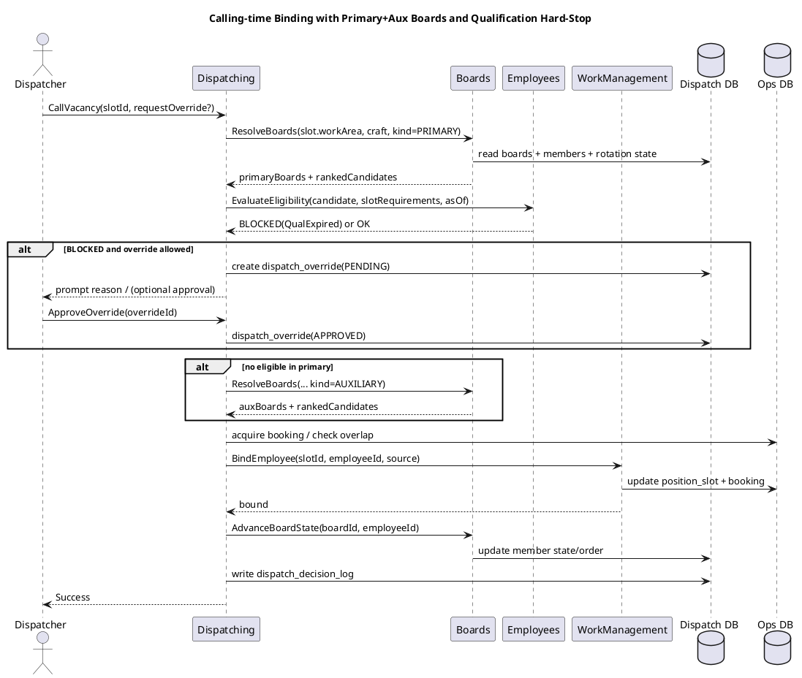

# SPEC-5-Boards and Dispatching Addendum (Aux Boards + Qualification Hard-Stop + Override)

## Background

Existing specs define:
- Dynamic railroad hierarchy and WorkAreas.
- Work demand (AssignmentTemplates → WorkInstances → PositionSlots).
- Employees (crafts/rosters/qualifications/availability/notifications).
- Board cascade/precedence concepts and projection vs calling.

This addendum closes the remaining “implementation-critical” gaps for:
- **Auxiliary boards** (e.g., Off-Day Boards) as a **fallback only** supply source.
- **Qualification expiry** as a **hard-stop** at call time.
- A controlled **override** mechanism with auditable reasons.


## Requirements

### Must Have
- **[R-BRD-001] Auxiliary board support**: Boards can be tagged as `PRIMARY` (extra board) or `AUXILIARY` (off-day board, etc.). Auxiliary boards are only considered when the primary cascade is exhausted.
- **[R-BRD-002] Exhaustion semantics**: “Exhausted” is deterministic and reproducible for a vacancy as-of time.
- **[R-DSP-001] Hard-stop qualification checks**: Dispatching must block assignment when required qualifications are expired/missing.
- **[R-DSP-002] Override mechanism**: Authorized users can override hard-stops to bind an employee, with required reason and full audit.
- **[R-DSP-003] No double booking**: Assignment binding remains globally exclusive across crafts.
- **[R-DSP-004] Deterministic selection**: Candidate ranking and skip reasons are recorded to support dispute resolution.

### Should Have
- **[R-BRD-101] Disqualification reasons**: Provide structured reasons (e.g., `QUAL_EXPIRED`, `NOT_AVAILABLE`, `REST_REQUIRED`, `ALREADY_ASSIGNED`).
- **[R-DSP-101] Override reporting**: A read model for “Overrides by reason / by dispatcher / by craft.”

### Could Have
- **[R-DSP-201] Second-person approval**: Optional “two-person rule” for overrides (feature flag).


## Method

### Bounded Contexts (Clean Architecture alignment)
- **Boards**: owns board definitions, membership, ordering/rotation state, and cascade resolution.
- **Policies**: owns strategy selection (FIFO vs tie-up-time, etc.) and configuration.
- **Dispatching**: owns projection and calling-time binding; orchestrates boards + employees + work.
- **Employees**: owns qualifications/availability and emits authoritative changes/events.
- **WorkManagement**: owns WorkInstances/PositionSlots; Dispatching binds via WorkManagement write APIs.

> SRP: Boards never decides “is employee qualified”; it only ranks members. Dispatching asks Employees for eligibility.

### Data Model Extensions

#### Boards
Add fields to support primary vs auxiliary boards and deterministic exhaustion checks.

```sql
-- Extend existing extra_board table
ALTER TABLE extra_board
ADD board_kind VARCHAR(16) NOT NULL DEFAULT 'PRIMARY', -- PRIMARY | AUXILIARY
ADD is_active BIT NOT NULL DEFAULT 1;

-- Optional: represent a named auxiliary board type
ALTER TABLE extra_board
ADD aux_board_type VARCHAR(32) NULL; -- e.g., 'OFF_DAY'

-- Board resolution policy: primary then auxiliary fallback
CREATE TABLE board_cascade_policy (
  policy_id UNIQUEIDENTIFIER PRIMARY KEY,
  work_area_id UNIQUEIDENTIFIER NOT NULL,
  craft_id UNIQUEIDENTIFIER NOT NULL,
  cascade_mode VARCHAR(24) NOT NULL, -- WORKAREA_ONLY | UP_HIERARCHY
  max_levels INT NULL,
  aux_fallback_enabled BIT NOT NULL DEFAULT 0,
  aux_fallback_scope VARCHAR(24) NULL, -- SAME_LEVEL | UP_HIERARCHY
  aux_max_levels INT NULL
);
```

#### Dispatching Overrides + Audit
```sql
CREATE TABLE dispatch_override (
  override_id UNIQUEIDENTIFIER PRIMARY KEY,
  position_slot_id UNIQUEIDENTIFIER NOT NULL,
  work_instance_id UNIQUEIDENTIFIER NOT NULL,
  employee_id UNIQUEIDENTIFIER NOT NULL,
  craft_id UNIQUEIDENTIFIER NOT NULL,
  override_type VARCHAR(32) NOT NULL, -- QUALIFICATION | REST | AVAILABILITY | OTHER
  reason_code VARCHAR(64) NOT NULL,
  reason_text NVARCHAR(512) NULL,
  created_by UNIQUEIDENTIFIER NOT NULL,
  created_at_utc DATETIME2 NOT NULL,
  approved_by UNIQUEIDENTIFIER NULL,
  approved_at_utc DATETIME2 NULL,
  status VARCHAR(16) NOT NULL -- PENDING | APPROVED | REJECTED | APPLIED
);

CREATE TABLE dispatch_decision_log (
  decision_id UNIQUEIDENTIFIER PRIMARY KEY,
  position_slot_id UNIQUEIDENTIFIER NOT NULL,
  as_of_utc DATETIME2 NOT NULL,
  phase VARCHAR(16) NOT NULL, -- PROJECTION | CALLING
  board_trace NVARCHAR(MAX) NOT NULL, -- ordered boards considered
  candidate_trace NVARCHAR(MAX) NOT NULL, -- ordered candidates + skip reasons
  selected_employee_id UNIQUEIDENTIFIER NULL,
  selection_source VARCHAR(32) NULL, -- EXTRA_BOARD | MANUAL | CREW_PREFILL
  created_by UNIQUEIDENTIFIER NOT NULL,
  created_at_utc DATETIME2 NOT NULL
);
```

### Core Algorithms

#### A) Resolve board cascade with auxiliary fallback
**Rule:** Try PRIMARY cascade first. If **exhausted**, then try AUXILIARY cascade.

Exhausted means: after ranking + filtering, there is **no eligible candidate** remaining (before overrides).

Pseudo:
1. `primaryBoards = ResolveBoards(kind=PRIMARY, workArea, craft, cascadePolicy)`
2. `candidate = RankAndFilter(primaryBoards)`
3. if none → `auxBoards = ResolveBoards(kind=AUXILIARY, workArea, craft, auxPolicy)`
4. `candidate = RankAndFilter(auxBoards)`

#### B) Calling-time binding with hard-stop + override
At calling time:
1. Determine `candidateEmployeeId` using algorithm A.
2. Call Employees: `EvaluateEligibility(employeeId, craftId, slotRequirements, asOfTime)`.
3. If eligibility is **BLOCKED**:
   - If override requested and user authorized: create `dispatch_override(PENDING)` → optional approval flow → if approved then proceed.
   - Else: record skip reason, advance to next candidate.
4. Acquire global booking lock (or use booking exclusion constraint) and bind via WorkManagement.
5. Advance board state using policy (`last_offered_at`, `last_assigned_at`, `order_index` updates).
6. Persist `dispatch_decision_log` (includes skip reasons and override details).

### PlantUML




## Implementation

1. **Boards module**
   - Add `board_kind` and optional `aux_board_type` to `extra_board`.
   - Add `board_cascade_policy` with `aux_fallback_enabled`.
   - Implement `ResolveBoards(workArea, craft, kind)` honoring cascade and max-levels.

2. **Employees module**
   - Ensure `EvaluateEligibility` can return structured `BLOCKED` with `reasons[]`.
   - Publish `qualification.expired` events (already specified) and ensure Dispatching uses point-in-time evaluation at call time.

3. **Dispatching module**
   - Implement `CallVacancy` orchestration:
     - primary → auxiliary fallback
     - eligibility hard-stop
     - override flow
     - bind + audit
   - Add `dispatch_override` + `dispatch_decision_log` tables and write paths.

4. **WorkManagement module**
   - Expose idempotent `BindEmployee(slotId, employeeId, source, requestId)`.
   - Enforce global overlap via booking constraint/application lock.

5. **UI**
   - Dispatch console: show primary vs auxiliary source, show skip reasons, allow “Request Override” with reason.
   - Admin: configure auxiliary boards and aux fallback policy.


## Milestones

1. **BRD-1**: Boards data model extensions + CRUD for auxiliary boards.
2. **BRD-2**: Cascade resolution (primary then auxiliary) + deterministic exhaustion.
3. **DSP-1**: Eligibility gate (hard-stop) integrated into calling.
4. **DSP-2**: Override flow + audit logs + minimal UI.
5. **DSP-3**: Reporting read model for overrides + skip reasons.


## Gathering Results

- Metrics:
  - % vacancies filled from primary vs auxiliary boards.
  - # calls blocked by qualification expiry.
  - # overrides by reason/craft/dispatcher; override acceptance rate.
  - Mean time to fill vacancy after call time.
- Audits:
  - For any assignment: reproduce board list, candidate order, skip reasons, and override trail.


## Need Professional Help in Developing Your Architecture?

Please contact me at [sammuti.com](https://sammuti.com) :)

