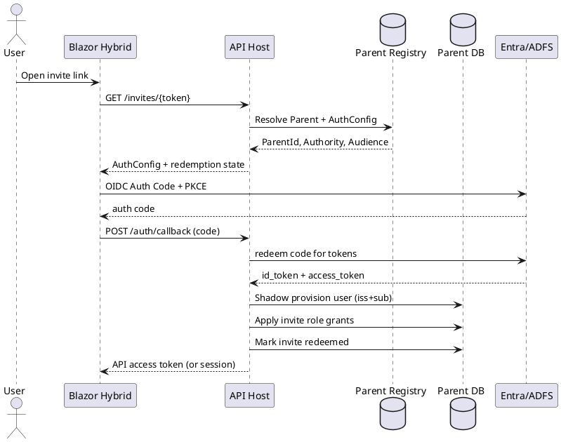
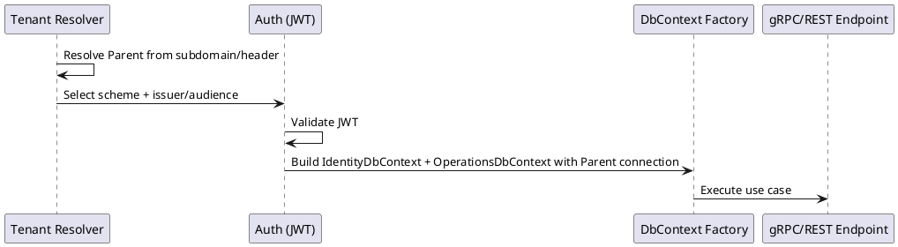

# SPEC-6-Authentication, Tenancy, and Invite-Only Access

## Background
The system must support multiple Parents that are completely isolated at the database level (one physical database per Parent). Some Parents will authenticate via Active Directory (Microsoft Entra ID or on-prem ADFS) while others will use local credentials. The client is a Blazor Hybrid application that calls gRPC services (with REST transcoding) hosted by the API.

## Requirements

### Must Have
- **One physical database per Parent** (SQL Server in production; SQLite in development).
- **Two DbContexts** targeting the same Parent DB:
  - `IdentityDbContext` (ASP.NET Core Identity + identity/audit + optional OpenIddict tables)
  - `OperationsDbContext` (domain/railroad operations)
- Support **both**:
  - External OIDC via **Entra ID** and **ADFS**
  - Internal OIDC (local users) for Parents without AD
- **Invite-only** user onboarding (no self-signup). Invite must encode/identify the intended **Parent**.
- API must accept **JWT Bearer** tokens and enforce authorization via policies.
- Support **both** Entra/ADFS **Groups** and **App Roles** mappings to application roles/permissions.
- Shadow provisioning for external identities (create/update local user record on first successful sign-in).
- Prevent cross-Parent token usage (a token issued for Parent A must not be accepted for Parent B).

### Should Have
- Admin UI/API to manage invites, role assignments, and mapping rules.
- Central “Parent Registry” service/store to resolve Parent → connection string + auth configuration.

### Could Have
- MFA policies per Parent.
- Device enrollment / conditional access integration for Entra.

## Method

### 1) Tenancy Resolution (Authoritative)
**Rule:** Parent is resolved *before* authentication and before creating any DbContext.

Supported resolution methods (choose at deployment time):
- **Subdomain**: `https://{parentSlug}.api.yourapp.com` (preferred)
- **Header**: `X-Parent-Slug` or `X-Parent-Id` (Hybrid client-controlled)

Once resolved:
- Load Parent DB connection string.
- Load Parent auth provider configuration.
- Configure JWT validation dynamically for that Parent.

### 2) Parent Registry (Global)
A small global store is required to map Parent identity to:
- DB connection information
- OIDC provider type and parameters

**Table: `ParentRegistry` (global)**
- `ParentId` (Guid, PK)
- `ParentSlug` (string, unique)
- `DbConnection` (string or key reference)
- `ProviderType` (enum: `InternalOidc`, `ExternalOidc_Entra`, `ExternalOidc_ADFS`)
- `Authority` (string)
- `Audience` (string)
- `GroupClaimType` (string; typically `groups`)
- `RoleClaimType` (string; typically `roles`)
- `EnableGroupOverageHandling` (bool)
- `RoleMappingJson` (json; external group/app-role → internal roles/permissions)

> Note: For Entra group overage, prefer App Roles for MVP; but this spec supports both.

### 3) Database Layout per Parent
One physical DB per Parent contains both contexts’ tables.

#### 3.1 EF Core Migration Histories
Each DbContext must use a distinct migrations history table:
- `__EFMigrationsHistory_Identity`
- `__EFMigrationsHistory_Ops`

#### 3.2 IdentityDbContext
Use ASP.NET Core Identity with GUID keys:
- `AspNetUsers`, `AspNetRoles`, `AspNetUserRoles`, `AspNetUserClaims`, `AspNetRoleClaims`, etc.

**Columns added to `AspNetUsers` (ApplicationUser):**
- `ExternalProvider` (string; `Internal|Entra|ADFS`)
- `ExternalIssuer` (string; OIDC `iss`)
- `ExternalSubject` (string; OIDC `sub`)
- `DisplayName` (string)
- `IsDisabled` (bool)

**Indexes:**
- Unique(`ExternalIssuer`, `ExternalSubject`) where `ExternalProvider != 'Internal'`

**Optional (only for InternalOidc Parents):** OpenIddict tables in the same DB.

#### 3.3 OperationsDbContext
Domain tables live here.

**User↔Employee bridge (optional linkage): `UserEmployeeLink`**
- `UserId` (Guid; Identity user id)
- `EmployeeId` (Guid)
- `LinkType` (string/enum)
- Unique(`UserId`, `EmployeeId`)

### 4) Invite-Only Onboarding
No public registration endpoints.

#### 4.1 Invite Token Format
Invite must unambiguously identify Parent.

**Invite payload (signed, time-limited):**
- `invite_id` (Guid)
- `parent_id` (Guid)
- `email` (string)
- `intended_provider` (enum: Internal/Entra/ADFS/Any)
- `roles` (list of internal role names) and/or `permissions` (list)
- `expires_at` (UTC timestamp)

Implementation options:
- **Preferred:** signed JWT invite token (HMAC or asymmetric) stored server-side for revocation.
- Alternative: random opaque token stored hashed in DB.

**Table: `Invites` (IdentityDbContext)**
- `InviteId` (Guid, PK)
- `ParentId` (Guid)
- `Email` (string)
- `IntendedProvider` (string)
- `RoleGrantsJson` (json)
- `ExpiresAtUtc` (datetime)
- `RedeemedAtUtc` (datetime, nullable)
- `RedeemedByUserId` (Guid, nullable)
- `RevokedAtUtc` (datetime, nullable)
- Index(`ParentId`, `Email`)

#### 4.2 Invite Redemption Flows

**A) External OIDC (Entra/ADFS) Parent**
1. User clicks invite link → API receives `invite_token`.
2. API validates invite and extracts `parent_id`.
3. Client initiates OIDC sign-in against Parent’s configured authority.
4. On callback, API validates external token and **shadow-provisions** user:
   - Lookup by (`ExternalIssuer`,`ExternalSubject`)
   - If not found, create new `AspNetUsers` record.
   - Ensure `Email` matches invited email (or allow configured relaxations).
5. Apply role/permission grants from invite.
6. Mark invite redeemed.

**B) Internal OIDC Parent**
1. User clicks invite link → API validates invite and extracts `parent_id`.
2. User sets initial password (or receives one-time password) via invite redemption screen.
3. Create `AspNetUsers` record with local credentials.
4. Apply role/permission grants from invite.
5. Issue tokens via internal OIDC.

### 5) External Claims Mapping (App Roles First; Groups Optional)

#### 5.1 Primary Mapping Rules
- **Entra ID (recommended):** use **App Roles** (token `roles` claim) as the **authoritative** source for application access.
  - This avoids Microsoft Graph dependencies and group overage complexity.
- **ADFS:** map either App Roles–equivalent claims (if configured) or group/role claims as provided by the ADFS issuance rules.

#### 5.2 Entra Group Handling Policy
- The system **does not require** Entra `groups` claims for authorization.
- If `groups` are present, they may be logged for diagnostics, but **access decisions are based on App Roles**.

#### 5.3 Mapping Storage
- `ParentRegistry.RoleMappingJson` maps external **App Role values** (and optionally ADFS claim values) → internal roles/permissions.

### 6) Token Validation and Cross-Parent Protection

**Rule:** A request for Parent X must only accept tokens from Parent X’s configured issuer(s).

Implementation:
- Middleware resolves Parent → loads `Authority` and allowed issuers.
- Authentication uses a dynamic scheme selection (PolicyScheme).
- Validate:
  - `iss` matches allowed issuers for Parent
  - `aud` matches configured audience
  - signature is valid

### 7) Authorization Model
- Use ASP.NET Core **Policy-based authorization**.
- Store coarse roles in `AspNetUserRoles`.
- Store fine-grained permissions as **RoleClaims**: `permission=Boards.Dispatch` etc.

**Scope checks** (e.g., WorkArea subtree access) are evaluated by Operations via a single service:
- `IAccessScopeService.CanDispatch(UserId, WorkAreaId)`

### 8) PlantUML Diagrams

#### 8.1 Invite + External OIDC Login

#### 8.2 Request Processing Order

## Implementation

1. **Create Parent Registry** (minimal service/table) and tenant resolution middleware.
2. Implement **two DbContexts** targeting same connection string; configure distinct migrations history tables.
3. Implement Identity with GUID keys and the shadow provisioning fields/indexes.
4. Implement Invite domain:
   - `Invites` table
   - create/revoke/redeem endpoints
   - email delivery integration
5. Implement Internal OIDC using OpenIddict for `InternalOidc` Parents.
6. Implement External OIDC handlers for Entra and ADFS:
   - JWT validation per Parent
   - claims normalization
   - optional Graph group overage resolution
7. Implement authorization policies + `IAccessScopeService` hook for WorkArea scope.
8. Add integration tests:
   - token from Parent A rejected by Parent B
   - invite redemption applies correct roles
   - external shadow provisioning idempotent

## Milestones
1. Tenant resolution + Parent registry + per-Parent DB connection.
2. IdentityDbContext working (local users) + invite CRUD.
3. Internal OIDC (OpenIddict) + Hybrid login.
4. External OIDC Entra (App Roles + Groups basic).
5. External OIDC ADFS (claims mapping).
6. Group overage support (Graph) behind feature flag.
7. End-to-end auth + authorization + scope checks.

## Gathering Results
- Verify cross-Parent isolation:
  - requests cannot authenticate or read data across Parents
- Verify invite-only requirement:
  - no new users created without an invite
- Verify role mapping correctness:
  - App roles and groups both map to expected internal roles/permissions
- Measure login + token validation latency under load.

## Need Professional Help in Developing Your Architecture?
Please contact me at [sammuti.com](https://sammuti.com) :)

