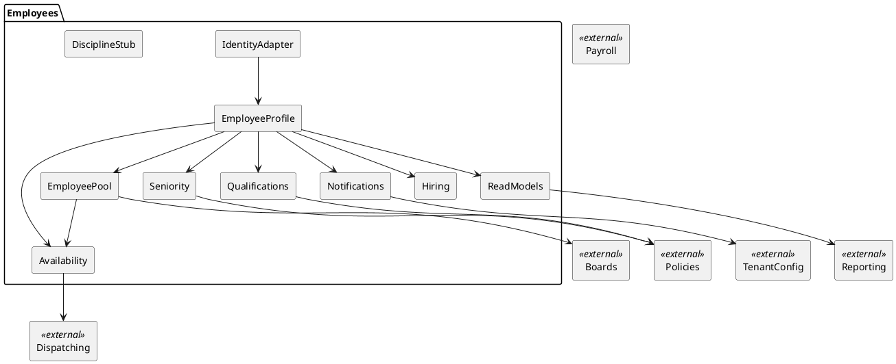
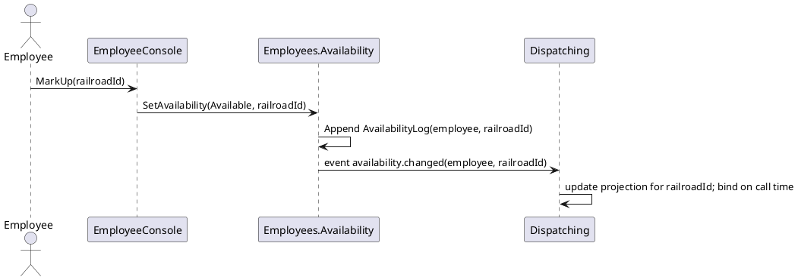

# SPEC-EMP-Employee Module

## Background

We are designing the **Employees** bounded context for a modular‑monolith, gRPC‑first railroad crew management platform. This module carries an HR presence and integrates with the operational crew ecosystem (Boards, Policies, Dispatching, Payroll). It must:

- Maintain authoritative employee master data for multiple parents (holding companies) and railroads under each parent (tenants).
- Manage craft‑specific seniority, multi‑board membership, global availability, and qualifications/certifications per craft.
- Support configurable HR workflows: hiring (job postings, candidate intake via future recruitment API), discipline (future), and flexible notification/communications to all employees or targeted groups in the org hierarchy.
- Serve upstream/downstream needs: provide availability/mark‑up/tie‑up signals to Dispatching and Boards; expose worked/assigned identity to Payroll; emit audit and read models to Reporting.
- Be policy‑driven and tenant‑aware so each parent/railroad can define requirements (qualification sets, hiring steps, discipline rules, notification preferences) without code changes.

**Key alignments with global system flows**
- Projection is non‑binding; calling time is authoritative → employee availability states must timestamp transitions for Dispatching to bind at call time.
- Employees may belong to multiple boards across crafts; availability is global → the module exposes a single availability truth with craft‑scoped overlays.
- Payroll is downstream → the module provides worked identity and HR status (active/leave/terminated) gates for pay eligibility.


## Requirements

**MoSCoW Prioritization**

### Must Have
- [R-EMP-001] Parent-owned HR master data with tenant-level overrides for fields and policies.
- [R-EMP-002] Multi-tenant hierarchy: Parent → Railroad(Tenant) → Division/WorkArea → Dynamic Groups/Boards.
- [R-EMP-003] Employee Profile: legal name, preferred name, **addresses (multi, primary flag)**, **emails (multi, verification, primary)**, **phones (multi, type, verification, primary)**, identifiers (employee #, union #), employment status, hire/term dates, craft memberships, seniority per craft, qualifications/certifications with validity windows, medical/DOT flags.
- [R-EMP-004] Global availability state machine (available, on-duty, tied-up, rest, leave types) with timestamped transitions; craft overlays compatible with Dispatching binding.
- [R-EMP-005] Seniority management per craft: effective date, tie-breakers (e.g., DOB last-4, random draw), audit of changes, freeze windows during disputes.
- [R-EMP-006] Qualification rulesets per craft: required quals bundle, prerequisites, expirations, grace periods, and blocking behavior for dispatch/payroll when expired.
- [R-EMP-007] In-app notifications: tenant-scoped templates, targeting by any dynamic group (TenantConfig), scheduling, read receipts, and delivery audit.
- [R-EMP-008] Employee Console (Blazor): view/update profile (scoped fields), view boards, availability/mark-up/tie-up, notification inbox, seniority/quals visibility.
- [R-EMP-009] HR Admin Console: CRUD on employees, craft assignments, seniority editor with audit, quals assignment & bulk import, notification campaigns, job posting management.
- [R-EMP-010] Hiring basics: internal job postings, application placeholders, status tracking (draft/open/closed/filled), and API stubs for future recruitment integration.
- [R-EMP-011] Discipline process placeholder: case entity, statuses, attachments, and policy hook points (no business logic yet).
- [R-EMP-012] gRPC-first APIs with REST transcoding; module publishes domain events (employee.created, availability.changed, seniority.updated, qualification.expired, notification.sent/read, posting.opened/closed).
- [R-EMP-013] Security & roles: Parent HR Admin, Railroad HR Admin, Supervisor, Dispatcher (read-only subsets), Employee Self-Service; row-level tenant isolation.
- [R-EMP-014] Audit & reporting: immutable event log, read models for Reporting, export to CSV for HR actions; PII access logging.
- [R-EMP-015] Data model alignment with SQL Server prod & SQLite dev; migrations, seed data, and idempotent imports.
- **[R-EMP-016] Identity & Auth**: Integrate **Microsoft Identity** (ASP.NET Core Identity) with **JWT bearer** tokens for gRPC/REST; role/claim-based authorization; refresh token support; token lifetimes configurable per tenant.
- **[R-EMP-017] Self-Service Profile**: Employee-managed profile section (addresses, contacts, preferences); tenant policy defines which fields require HR approval; full audit trail and change requests.

### Should Have
- [R-EMP-101] Attachments vault for HR docs (licenses, medicals) with retention and access controls.
- [R-EMP-102] Bulk operations: employee import, seniority list import, qualifications bulk-assign, notification audience preview.
- [R-EMP-103] Effective-dated overrides at tenant level (fields, policies, templates).
- [R-EMP-104] Localization & time-zone handling (tenant default + per-user override).
- [R-EMP-105] Soft delete with rehire flow and seniority restoration policy options.

### Could Have
- [R-EMP-201] Candidate portal (public) for postings (behind feature flag).
- [R-EMP-202] Org chart & contact directory with dynamic group filters.
- [R-EMP-203] Preference center for notifications (topics/quiet hours).

### Won’t Have (Now)
- [R-EMP-301] SMS/Email channels for notifications (deferred).
- [R-EMP-302] Full discipline adjudication workflows (deferred to Policies/HR).
- [R-EMP-303] External payroll provider sync (out of scope for this module).

**Assumptions**
- [A-EMP-01] HR master data owned at Parent; railroad tenants may override select fields/policies.
- [A-EMP-02] Only in-app notifications in MVP; adapters for SMS/Email will be added later.
- [A-EMP-03] Identity via **Microsoft Identity**; JWT bearer for APIs; refresh-token rotation enabled.
- [A-EMP-04] No cross-border data residency constraints unless specified; PII governed by standard corporate policy.
- [A-EMP-05] Employee profile self-maintenance allowed; certain sensitive fields (e.g., legal name, DOT flags) are HR-managed-only by default, overridable per tenant policy.


## Method

### Architecture (module-internal components)
- **IdentityAdapter** – integrates Microsoft Identity; issues JWTs; enforces MFA (required for HR/Admin, optional for Employees); refresh-token rotation.
- **EmployeeProfile** – master data (Parent-owned with tenant overrides); self-service profile change queue w/ policy gates (legal name requires HR approval; addresses/phones/emails apply immediately with verification).
- **EmployeePool** – **Parent-scoped pool** of all employees; **railroad pool memberships** derive from craft qualifications and eligibility. Governs cross-railroad participation, caps, and priorities.
- **Seniority** – per-craft effective-dated ranks, import tools, freeze windows; deterministic tie-breaker policy (configurable per craft).
- **Qualifications** – craft-scoped required bundles, expirations, grace periods; blocking/allow-with-warning policy is tenant/craft-configurable.
- **Availability** – global state machine with craft overlays; **scoped by Railroad**; emits authoritative transitions for Dispatching to bind at call time.
- **Notifications** – in-app channel MVP; tenant templates, audience targeting from dynamic groups; read receipts & audits.
- **Hiring** – internal postings & basic candidate placeholders; API façade for future recruitment integration.
- **DisciplineStub** – case shell with attachments & statuses; policy hook points.
- **ReadModels & Events** – flattened read models for consoles/reporting; domain events on every significant change.

#### Component Diagram (PlantUML)

```

### gRPC Surface (high-level)
- `employees.v1.EmployeesService`
  - `GetEmployee`, `SearchEmployees`, `CreateEmployee`, `UpdateEmployee`, `ApproveChange` (legal name), `GetProfile`, `UpdateProfile`.
- `employees.v1.SeniorityService`
  - `GetCraftSeniority`, `ImportSeniorityList`, `UpdateRank`, `FreezeWindow`.
- `employees.v1.QualificationsService`
  - `ListQualifications`, `AssignQualification`, `RecordResult`, `ExpireQualification`.
- `employees.v1.AvailabilityService`
  - `GetAvailability(employee_id, railroad_id)`
  - `SetAvailability(employee_id, railroad_id, state)`
  - `MarkUp(employee_id, railroad_id)`
  - `TieUp(employee_id, railroad_id)`
  - `MarkOff(employee_id, railroad_id, reason, until?)`
  - `ReturnToAvailable(employee_id, railroad_id)`
- `employees.v1.NotificationsService`
  - `CreateTemplate`, `SendCampaign`, `ListInbox`, `AckDelivery`.
- `employees.v1.HiringService`
  - `CreatePosting`, `PublishPosting`, `ClosePosting`, `ListPostings`.
- `employees.v1.ContactVerificationService`
  - `StartEmailVerification`, `ConfirmEmailVerification`, `StartPhoneVerification`, `ConfirmPhoneVerification`, `AdminMarkVerified`.

_All services REST-transcoded for admin consoles. Publish domain events: `employee.created`, `employee.profile.updated`, `employee.legalname.pending_approval`, `employee.legalname.approved`, `seniority.updated`, `qualification.assigned|expired`, `availability.changed`, `notification.sent|read`, `jobposting.opened/closed`, `contact.verified`._

### Data Model (SQL Server / SQLite)

sql
-- Tenancy primitives
CREATE TABLE Parent (
  ParentId UNIQUEIDENTIFIER PRIMARY KEY,
  Name NVARCHAR(200) NOT NULL
);
CREATE TABLE Railroad (
  RailroadId UNIQUEIDENTIFIER PRIMARY KEY,
  ParentId UNIQUEIDENTIFIER NOT NULL REFERENCES Parent(ParentId),
  Name NVARCHAR(200) NOT NULL
);

-- Employee master
CREATE TABLE Employee (
  EmployeeId UNIQUEIDENTIFIER PRIMARY KEY,
  ParentId UNIQUEIDENTIFIER NOT NULL REFERENCES Parent(ParentId),
  RailroadId UNIQUEIDENTIFIER NULL REFERENCES Railroad(RailroadId), -- optional default home railroad
  EmployeeNumber NVARCHAR(50) UNIQUE,
  LegalFirst NVARCHAR(100) NOT NULL,
  LegalLast NVARCHAR(100) NOT NULL,
  PreferredFirst NVARCHAR(100) NULL,
  PreferredLast NVARCHAR(100) NULL,
  Status NVARCHAR(30) NOT NULL, -- Active/Leave/Terminated
  HireDate DATE NOT NULL,
  TermDate DATE NULL,
  UnionNumber NVARCHAR(50) NULL,
  DotFlag BIT NOT NULL DEFAULT 0,
  CreatedAt DATETIME2 NOT NULL DEFAULT SYSUTCDATETIME()
);
CREATE TABLE EmployeeAddress (
  AddressId UNIQUEIDENTIFIER PRIMARY KEY,
  EmployeeId UNIQUEIDENTIFIER NOT NULL REFERENCES Employee(EmployeeId),
  Type NVARCHAR(20) NOT NULL, -- Residential/Mailing
  Line1 NVARCHAR(200) NOT NULL,
  Line2 NVARCHAR(200) NULL,
  City NVARCHAR(100) NOT NULL,
  State NVARCHAR(100) NOT NULL,
  PostalCode NVARCHAR(20) NOT NULL,
  Country NVARCHAR(100) NOT NULL,
  IsPrimary BIT NOT NULL DEFAULT 0,
  EffectiveFrom DATETIME2 NOT NULL DEFAULT SYSUTCDATETIME(),
  EffectiveTo DATETIME2 NULL
);
CREATE TABLE EmployeeEmail (
  EmailId UNIQUEIDENTIFIER PRIMARY KEY,
  EmployeeId UNIQUEIDENTIFIER NOT NULL REFERENCES Employee(EmployeeId),
  Email NVARCHAR(256) NOT NULL,
  IsPrimary BIT NOT NULL DEFAULT 0,
  VerifiedAt DATETIME2 NULL
);
CREATE TABLE EmployeePhone (
  PhoneId UNIQUEIDENTIFIER PRIMARY KEY,
  EmployeeId UNIQUEIDENTIFIER NOT NULL REFERENCES Employee(EmployeeId),
  Type NVARCHAR(20) NOT NULL, -- Mobile/Home/Work
  E164 NVARCHAR(32) NOT NULL,
  IsPrimary BIT NOT NULL DEFAULT 0,
  VerifiedAt DATETIME2 NULL
);

-- Crafts & Seniority
CREATE TABLE Craft (
  CraftId UNIQUEIDENTIFIER PRIMARY KEY,
  ParentId UNIQUEIDENTIFIER NOT NULL REFERENCES Parent(ParentId),
  Code NVARCHAR(20) NOT NULL, Name NVARCHAR(100) NOT NULL
);
CREATE TABLE EmployeeSeniority (
  EmployeeCraftId UNIQUEIDENTIFIER PRIMARY KEY,
  EmployeeId UNIQUEIDENTIFIER NOT NULL REFERENCES Employee(EmployeeId),
  RailroadId UNIQUEIDENTIFIER NOT NULL REFERENCES Railroad(RailroadId),
  CraftId UNIQUEIDENTIFIER NOT NULL REFERENCES Craft(CraftId),
  SeniorityDate DATE NOT NULL,
  Rank INT NOT NULL,
  TieBreaker NVARCHAR(50) NULL,
  UNIQUE(EmployeeId, RailroadId, CraftId)
);
CREATE TABLE SeniorityFreeze (
  FreezeId UNIQUEIDENTIFIER PRIMARY KEY,
  RailroadId UNIQUEIDENTIFIER NOT NULL REFERENCES Railroad(RailroadId),
  CraftId UNIQUEIDENTIFIER NOT NULL REFERENCES Craft(CraftId),
  FromDate DATE NOT NULL, ToDate DATE NOT NULL,
  Reason NVARCHAR(200) NULL
);

-- Qualifications
CREATE TABLE QualificationType (
  QualificationTypeId UNIQUEIDENTIFIER PRIMARY KEY,
  ParentId UNIQUEIDENTIFIER NOT NULL REFERENCES Parent(ParentId),
  CraftId UNIQUEIDENTIFIER NULL REFERENCES Craft(CraftId),
  Code NVARCHAR(50) NOT NULL, Name NVARCHAR(200) NOT NULL,
  ExpiresInDays INT NULL, GraceDays INT NULL,
  IsBlocking BIT NOT NULL DEFAULT 1
);
CREATE TABLE EmployeeQualification (
  EmployeeQualificationId UNIQUEIDENTIFIER PRIMARY KEY,
  EmployeeId UNIQUEIDENTIFIER NOT NULL REFERENCES Employee(EmployeeId),
  QualificationTypeId UNIQUEIDENTIFIER NOT NULL REFERENCES QualificationType(QualificationTypeId),
  AchievedAt DATETIME2 NOT NULL,
  ExpiresAt DATETIME2 NULL,
  Status NVARCHAR(20) NOT NULL -- Active/Expired/Revoked
);

-- Availability
CREATE TABLE AvailabilityLog (
  AvailabilityId UNIQUEIDENTIFIER PRIMARY KEY,
  EmployeeId UNIQUEIDENTIFIER NOT NULL REFERENCES Employee(EmployeeId),
  State NVARCHAR(20) NOT NULL, -- Available/OnDuty/TiedUp/Rest/Leave
  Reason NVARCHAR(100) NULL,
  CraftId UNIQUEIDENTIFIER NULL, -- overlay when relevant
  OccurredAt DATETIME2 NOT NULL DEFAULT SYSUTCDATETIME()
);

-- Notifications
CREATE TABLE NotificationTemplate (
  TemplateId UNIQUEIDENTIFIER PRIMARY KEY,
  ParentId UNIQUEIDENTIFIER NOT NULL REFERENCES Parent(ParentId),
  RailroadId UNIQUEIDENTIFIER NULL REFERENCES Railroad(RailroadId),
  Code NVARCHAR(50) UNIQUE NOT NULL,
  Subject NVARCHAR(200) NOT NULL,
  Body NVARCHAR(MAX) NOT NULL
);
CREATE TABLE NotificationDelivery (
  DeliveryId UNIQUEIDENTIFIER PRIMARY KEY,
  EmployeeId UNIQUEIDENTIFIER NOT NULL REFERENCES Employee(EmployeeId),
  TemplateId UNIQUEIDENTIFIER NOT NULL REFERENCES NotificationTemplate(TemplateId),
  SentAt DATETIME2 NOT NULL DEFAULT SYSUTCDATETIME(),
  ReadAt DATETIME2 NULL,
  AudienceSnapshot NVARCHAR(MAX) NULL
);

-- Hiring
CREATE TABLE JobPosting (
  JobPostingId UNIQUEIDENTIFIER PRIMARY KEY,
  RailroadId UNIQUEIDENTIFIER NOT NULL REFERENCES Railroad(RailroadId),
  CraftId UNIQUEIDENTIFIER NOT NULL REFERENCES Craft(CraftId),
  Title NVARCHAR(200) NOT NULL,
  Description NVARCHAR(MAX) NOT NULL,
  Status NVARCHAR(20) NOT NULL -- Draft/Open/Closed/Filled
);

-- Legal name change approvals
CREATE TABLE ProfileChangeRequest (
  RequestId UNIQUEIDENTIFIER PRIMARY KEY,
  EmployeeId UNIQUEIDENTIFIER NOT NULL REFERENCES Employee(EmployeeId),
  Field NVARCHAR(50) NOT NULL, -- LegalName
  RequestedValue NVARCHAR(MAX) NOT NULL,
  Status NVARCHAR(20) NOT NULL, -- Pending/Approved/Rejected
  RequestedAt DATETIME2 NOT NULL DEFAULT SYSUTCDATETIME(),
  DecidedAt DATETIME2 NULL,
  DecidedBy UNIQUEIDENTIFIER NULL
);
```

### Availability State Machine
- **Scope:** All states and transitions are **per Railroad**. The same employee may hold different states concurrently across different railroads if policy permits.
- **States:** `Available`, `OnDuty`, `TiedUp`, `Rest`, `Leave`, `MarkOff`.
- **Transitions (allowed):**
  - `Available → OnDuty` (assignment begins)
  - `OnDuty → TiedUp` (work completed)
  - `TiedUp → Rest` (mandatory rest)
  - `Rest → Available` (rest complete)
  - `Available → MarkOff` (employee marks off/unavailable for personal reasons)
  - `MarkOff → Available` (employee returns to the extra list/board availability)
  - `Any → Leave` / `Leave → Available` (HR status changes)
- **Guards:**
  - `MarkOff` is not permitted while `OnDuty` **for that railroad**; attempt results in validation error.
  - Tenant policy may restrict `MarkOff` duration and require reason codes.
  - Transitions require an active `EmployeeRailroadMembership` for the target `railroad_id`.
- Every transition appends to `AvailabilityLog` with `(employee_id, railroad_id, from_state, to_state, reason, craft_overlay?, occurred_at_utc, actor)`; Dispatching binds at call time using the latest log for the **same railroad**.

#### Transition Validity Table
| From \ To    | Available | OnDuty | TiedUp | Rest | Leave | MarkOff |
|---|---:|---:|---:|---:|---:|---:|
| **Available** | – | ✅ | ❌ | ❌ | ✅ | ✅ |
| **OnDuty**    | ❌ | – | ✅ | ❌ | ✅ | ❌ |
| **TiedUp**    | ❌ | ❌ | – | ✅ | ✅ | ❌ |
| **Rest**      | ✅ | ❌ | ❌ | – | ✅ | ❌ |
| **Leave**     | ✅ | ❌ | ❌ | ❌ | – | ❌ |
| **MarkOff**   | ✅ | ❌ | ❌ | ❌ | ✅ | – |

> Legend: ✅ allowed, ❌ denied, – same state

#### Command Validation Rules (MVP)
- `SetAvailability(Available)`
  - Allowed from `Rest`, `Leave`, `MarkOff`.
  - Deny if `OnDuty` or `TiedUp`.
- `MarkUp()` (alias for `SetAvailability(Available)` when coming from `Rest` after rest window elapsed)
  - Extra guard: ensure mandatory rest period has elapsed per policy.
- `MarkOff(reason, until?)`
  - Allowed only from `Available`.
  - Require `reason` from tenant-configured list; optional `until` with max duration per policy; create auto-return job when `until` elapses.
- `ReturnToAvailable()`
  - Allowed only from `MarkOff` or `Leave` (if HR clears leave).
- `TieUp()`
  - Allowed only from `OnDuty`.
- `SetRest()`
  - Allowed only from `TiedUp`.
- `SetLeave(type)`
  - Allowed from any state; requires HR privileges or approved Absence/Vacancy linkage.
- All commands:
  - Enforce idempotency by ignoring no-op transitions (same state with same effective timestamp).
  - Append `AvailabilityLog` with `(employee_id, from_state, to_state, reason, craft_overlay?, occurred_at_utc, actor)`.


### Security & Authorization
- **AuthN:** Microsoft Identity with JWT bearer; MFA enforced for HR/Admin roles.
- **AuthZ:** Role + claim policies: `role:ParentHR`, `role:RailroadHR`, `role:Supervisor`, `role:Dispatcher`, `role:Employee`; tenant scoping via `parent_id`, `railroad_id` claims; row-level filters in repositories.
- **PII controls:** Address/phone/email updates allowed by Employee; Legal name requires HR approval. Access to DOT/medical flags gated by `claim:pii.restricted` and audited.

### Multi-Railroad Policy Knobs
- **Eligibility source:** `EmployeeRailroadMembership` + `EmployeeSeniority` required for dispatch/availability.
- **Home railroad priority:** Prefer calls from `IsHome = 1` railroad when employee is available in multiple; configurable override for small ops.
- **Max concurrent availability railroads:** default 1, configurable (e.g., up to 3) per parent or railroad.
- **Cross-railroad rest harmonization:** rest accrual is **global**; cannot be `Available` in Railroad B if `TiedUp/Rest` due to work in Railroad A until rest window elapses (window defined in Policies).
- **Conflict resolution:** if two railroads attempt to bind simultaneously, the first authoritative **calling-time** wins; others receive a hold/reject with reason `already bound`.

### Notification Targeting
- Target audiences expressed as **TenantConfig dynamic-group queries** (e.g., `craft == "Conductor" AND division IN (...)`).
- **Supervisor routing** resolves via dynamic group key `craft-supervisors:{craft}` (recommended default); fallback to explicit per-craft contacts if group empty.
- System snapshots audience per delivery for audit. In-app only for MVP.

### Hiring Flow (MVP)
1. HR creates Draft `JobPosting` → Publish (Open).
2. HR enrolls candidates into a **HiringBatch**; selects **RankAssignmentPolicy**.
3. Ranker computes deterministic ranks → persists to `HiringBatchCandidate.AssignedRank` and `EmployeeSeniority.Rank`.
4. Internal candidates can express interest (placeholder record) or HR can attach prospects.
5. Close or Fill; events emitted; no onboarding automation yet.

#### Sequence: Employee Mark-Up (availability) → Dispatching



## Implementation

### Identity & Auth
- Configure **ASP.NET Core Identity** with **JWT Bearer** for gRPC/REST; **MFA required** for HR/Admin roles via Microsoft Authenticator; optional for Employees.
- Claims for tenant scoping: `parent_id`, `railroad_id`; role policies as defined. Token lifetime & refresh configured per tenant.

### Contact Verification (future-proofing)
- Store multi email/phone with `VerifiedAt` timestamps.
- Provide UX to initiate verification → generates a time-limited code/token stored server-side.
- **No outbound send** in MVP; HR Admin may mark verified after out-of-band confirmation; when Email/SMS channels arrive, reuse same endpoints to deliver codes.

### Services & Handlers
- gRPC services per Method section with REST transcoding.
- **Command handlers**: Create/UpdateEmployee, UpdateProfile (immediate write for address/phone/email), RequestLegalNameChange → `ProfileChangeRequest`.
- **Seniority ranker** (application service): executes selected `RankAssignmentPolicy` for a `HiringBatch`; persists ranks atomically and emits `seniority.updated`.
- **Qualification guard**: evaluates eligibility for dispatch; exposes `IsEmployeeEligibleForCraft(employeeId, craftId)` used by Dispatching.

### Background Jobs
- **QualificationExpiryNotifier** (daily): scans `EmployeeQualification` for upcoming expirations at 60/30/14/7 days; enqueues in-app notifications to employee + supervisor; deduplicates.
- **QualificationExpiryEnforcer** (hourly): flips status to `Expired` at `ExpiresAt`; emits `qualification.expired` event (Dispatching/Boards react to hard-block).

### Blazor UI (MVP)
- **Employee Self-Service**: Profile (addresses/emails/phones with verification badges), Availability (Mark-Up/Tie-Up), Inbox (notifications), Qualifications viewer with expiry badges.
- **HR Admin**: Employee CRUD, Seniority editor & **HiringBatch** ranking screen, Qualifications dashboard, Notification templates & audience preview, Job Posting CRUD.

### Integration & Events
- Publish/consume events via in-proc bus: `employee.created`, `employee.profile.updated`, `employee.legalname.pending_approval|approved|rejected`, `seniority.updated`, `qualification.assigned|expired`, `availability.changed`, `notification.sent|read`, `jobposting.opened|closed`.
- Reporting subscribes to build read models; Dispatching queries eligibility before call-time binding.

### Data & Migrations
- EF Core migrations for SQL Server/SQLite; seed Parents/Railroads/Crafts; seed default Notification templates; example **HiringBatch** strategies.

### Security/PII
- Audit log for all profile reads/writes; restricted PII (medical/DOT) requires `pii.restricted` claim; field-level authorization for legal name change.

### Testing
- Unit tests for `RankAssignmentPolicy` strategies; integration tests for availability state transitions; authorization tests for PII and MFA paths.

---

## Milestones
1. **EMP-1**: Identity & JWT + roles/MFA.
2. **EMP-2**: Employee master & self-service profile.
3. **EMP-3**: Availability state machine + console.
4. **EMP-4**: Qualifications (assign, expire, notifier, hard-block guard).
5. **EMP-5**: Seniority (**HiringBatch** + ranker + editor).
6. **EMP-6**: Notifications (in-app, templates, audience targeting).
7. **EMP-7**: Hiring (postings CRUD, internal interest placeholders).
8. **EMP-8**: Reporting read models & audits.

## Gathering Results
- KPIs: time-to-rank (batch run), % on-time qualification renewals, dispatch blocks due to quals, profile change turnaround, MFA adoption.
- Audits: deterministic rank reproducibility; PII access logs; notification delivery/read rates.

## Need Professional Help in Developing Your Architecture?
Please contact me at [sammuti.com](https://sammuti.com) :)

