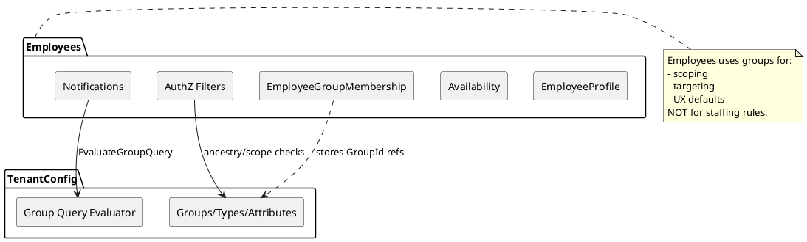

# SPEC-3-Employee Module Integration Into Dynamic Group Hierarchy

## Background

The platform’s core architectural principle is **tenant-defined, dynamic organizational structure** (Dynamic Groups) separated from **policy-driven operational behavior** (Boards/Policies/Dispatching). Dynamic Groups provide the navigation/scoping tree and an attachment point for operational entities such as WorkAreas, Boards, and Templates—without hard-coded hierarchy or staffing logic.

We are extending scope so the **Employees bounded context** is fully compatible with (and leverages) the Dynamic Group hierarchy for:

- **User scoping & RBAC** (who can see/do what, where) based on group ancestry.
- **Operational resolution inputs** (e.g., board cascade needs WorkArea → parent chain context).
- **Employee-facing functionality** that depends on group context: notifications/communications targeted to groups, employee directory/org filters, and “my world” defaults (home terminal, reporting chain).

This integration must preserve the existing rule that **Groups do not encode operational rules**; the Employees module consumes group structure for scoping/targeting/context only, while Dispatching/Policies remain the source of operational decisions.

## Requirements

### Must Have

- **[R-INT-001] Employee ↔ TenantConfig linkage**: Every employee belongs to a Parent and may have a default/home Railroad; employee membership in Railroads is explicit (eligibility/participation) and enforced in availability transitions.
- **[R-INT-002] Employee ↔ Dynamic Group membership (effective-dated)**: Support *multiple*, **effective-dated** memberships of an employee to Groups (e.g., home work area, department, supervisor group). Membership is used for scoping/targeting and must not drive dispatch ordering.
- **[R-INT-003] Exactly one Home WorkArea (parent-scoped with optional home railroad)**: Each employee has **exactly one active “Home WorkArea”**.
  - For most employees, it is scoped to a **Home Railroad** (and is used as the default context for cross-railroad visibility).
  - For roving employees, Home WorkArea can be **Parent-scoped** (no railroad affinity).
  - Home WorkArea is used for UX defaults and routing, not staffing rules.
- **[R-INT-004] Group-scoped authorization for Employees module**: Employee and HR/Admin experiences are filtered by the caller’s group scope and ancestry (consistent with the platform RBAC+Scope model).
- **[R-INT-005] Group-based audience targeting for notifications**: Notification campaigns can target employees by dynamic group queries and must snapshot the resolved audience for auditability.
- **[R-INT-006] WorkArea-context UX defaults**: Employee Console and dispatcher tooling can default views (boards, upcoming work, notifications) based on employee’s configured “Home WorkArea,” without making that an operational rule.
- **[R-INT-007] Cross-module boundaries preserved**: Employees module does not query TenantConfig DB tables directly; it integrates via TenantConfig application interfaces and/or events.

### Should Have

- **[R-INT-101] Supervisor routing via groups**: Default supervisor/manager resolution for notifications and approvals using conventional group keys (e.g., `craft-supervisors:{craft}`), with fallback to explicit assignments.
- **[R-INT-102] Org directory views**: Search employees filtered by group scope and optionally by group membership.

### Could Have

- **[R-INT-201] Effective-dated org moves**: Support scheduled future moves of employees between groups (terminal transfers) with a clean audit trail.

### Won’t Have (Now)

- **[R-INT-301] Groups as operational constraints**: No staffing/calling logic derived directly from group memberships (kept policy-driven).

## Method

### 1) Integration Contract Between Employees and TenantConfig

**Goal:** Employees can *resolve* group structure/memberships for scoping/targeting without tight coupling.

- Employees module depends on TenantConfig via:
  1) **In-process application interface** (preferred in modular monolith)
  2) **Domain events** for denormalized read models (optional; enables reporting/search efficiency)

**Key calls needed from TenantConfig** (conceptual):

- `GetGroup(groupId)`
- `GetGroupAncestry(groupId)`
- `ListGroupsByType(tenantId, groupType)`
- `EvaluateGroupQuery(tenantId, queryExpression)` → returns groupIds

### 2) EmployeeGroupMembership (new Employees data model)

**Purpose:** Capture employee placement and org semantics (home work area, department, supervisor roster) without embedding operational rules.

#### Core table

- `EmployeeGroupMembership`
  - `EmployeeGroupMembershipId` (GUID)
  - `EmployeeId`
  - `GroupId`
  - `RailroadId` (required for `RoleInGroup=HomeWorkArea`; optional otherwise)
  - `RoleInGroup` (enum: `HomeWorkArea`, `Assigned`, `Supervisor`, `Member`)
  - `EffectiveFromUtc`, `EffectiveToUtc` (NULL = open-ended)
  - `IsPrimary` (BIT)
  - `CreatedBy`, `CreatedAtUtc`
  - `EndedBy`, `EndedAtUtc` (optional convenience mirrors of `EffectiveToUtc`)

#### Invariants

- **Effective-dated by default**: all memberships are versioned by time.
- **Exactly one active Home WorkArea** (per employee):
  - At any point in time, an employee can have **at most one** `RoleInGroup=HomeWorkArea` where `IsPrimary=1` and `EffectiveToUtc IS NULL`.
  - `RailroadId` is **nullable**:
    - `RailroadId != NULL` → Home WorkArea is tied to the employee’s **Home Railroad**.
    - `RailroadId == NULL` → Home WorkArea is **Parent-scoped** (roving employee model).
  - The referenced `GroupId` **must** be a Group whose GroupType is marked `IsWorkArea=1` in TenantConfig.
- Membership changes are audited and emit `employee.group_membership.changed` events.

#### Suggested DB constraints (SQL Server)

- Index for lookups:
  - `IX_EGM_Employee_Effective` on `(EmployeeId, EffectiveFromUtc, EffectiveToUtc)`
  - `IX_EGM_Group_Effective` on `(GroupId, EffectiveFromUtc, EffectiveToUtc)`
- Enforce “one active home” with a filtered unique index (covers both parent-scoped and railroad-scoped homes):
  - `UNIQUE (EmployeeId)` **WHERE** `RoleInGroup = 'HomeWorkArea' AND IsPrimary = 1 AND EffectiveToUtc IS NULL`

> Note: time-window overlap prevention (e.g., two overlapping home memberships) is best enforced in the application layer using a transaction + range overlap query; SQL Server lacks native exclusion constraints.

### 3) Authorization Alignment (RBAC + Group Scope) (RBAC + Group Scope)

Employees APIs honor:

- **Role permissions** (Parent HR Admin, Railroad HR Admin, Supervisor, Dispatcher, Employee Self-Service)
- **Group scope**: caller has access to one or more Groups (often WorkAreas), optionally inheriting descendants; API queries are filtered to allowed scope.

Employees module must be able to:

- Determine whether an Employee is “in scope” for an actor based on group membership overlap + group ancestry rules from TenantConfig.

### 4) Notifications Targeting Using Dynamic Groups

Notification campaigns accept an **AudienceSelector**:

- `type = GROUP_QUERY` with a TenantConfig query expression producing groupIds
- `type = GROUP_IDS` explicit groupIds
- `type = EMPLOYEE_IDS` explicit employees

Resolution approach:

1) Employees module requests groupIds from TenantConfig (EvaluateGroupQuery).
2) Employees module resolves employees in those groups via `EmployeeGroupMembership` (effective-dated at send time).
3) Snapshot audience into `NotificationDelivery.AudienceSnapshot` for audit.

### 5) UX Defaults (non-operational)

Employee Console defaults:

- “My Home WorkArea” derived from `EmployeeGroupMembership(RoleInGroup=Home)`.
- Default filters for boards/work: uses WorkArea groupId as the default scoping context, but dispatch logic remains policy-driven.

### Component Diagram (PlantUML)



### 6) Concrete schemas & gRPC APIs (MVP)

#### Employees DB schema additions

In addition to `EmployeeGroupMembership` above, add two small helper read models to speed common queries:

- `EmployeeScopeIndex`
  - Purpose: fast “is employee in my scope?” checks for large tenants.
  - Columns: `EmployeeId`, `GroupId`, `AsOfDateUtc` (date), `IsActive`.
  - Build strategy (MVP): **don’t precompute**; compute at query time using `EmployeeGroupMembership` + TenantConfig ancestry. (Add this table later only if needed.)

- `EmployeeHomeContext` (optional denormalization)
  - `EmployeeId`, `RailroadId`, `HomeWorkAreaGroupId`, `EffectiveFromUtc`, `EffectiveToUtc`
  - Keep in sync from `EmployeeGroupMembership` where `RoleInGroup=HomeWorkArea AND IsPrimary=1`.

> MVP recommendation: start with **only** `EmployeeGroupMembership` and add denormalizations if profiling shows a need.

#### Employees application invariants (transactional)

When setting Home WorkArea:

1) Validate `GroupId` is a WorkArea group in TenantConfig.
2) End any existing active home membership for `EmployeeId` by setting `EffectiveToUtc = now`.
3) Insert new `EmployeeGroupMembership` with:
   - `RoleInGroup=HomeWorkArea`, `IsPrimary=1`
   - `EffectiveFromUtc=now`, `EffectiveToUtc=NULL`
   - `RailroadId`:
     - If employee uses **Home Railroad** model → set to `HomeRailroadId` (or request field `railroad_id`).
     - If employee is **roving** → set to `NULL` (Parent-scoped home).

All within a single transaction.

#### gRPC API surface (proposed)

**TenantConfig gRPC / app interface** (read-only from Employees perspective):

```proto
service TenantConfigGroups {
  rpc GetGroup(GetGroupRequest) returns (Group);
  rpc GetGroupAncestry(GetGroupAncestryRequest) returns (GetGroupAncestryResponse);
  rpc EvaluateGroupQuery(EvaluateGroupQueryRequest) returns (EvaluateGroupQueryResponse);
  rpc IsWorkAreaGroup(IsWorkAreaGroupRequest) returns (IsWorkAreaGroupResponse);
}

message GetGroupRequest { string tenant_id = 1; string group_id = 2; }
message GetGroupAncestryRequest { string tenant_id = 1; string group_id = 2; bool include_self = 3; }
message GetGroupAncestryResponse { repeated string ancestor_group_ids = 1; }

message EvaluateGroupQueryRequest {
  string tenant_id = 1;
  string query_expression = 2; // DSL owned by TenantConfig
}
message EvaluateGroupQueryResponse { repeated string group_ids = 1; }

message IsWorkAreaGroupRequest { string tenant_id = 1; string group_id = 2; }
message IsWorkAreaGroupResponse { bool is_work_area = 1; }
```

**Employees gRPC** (write + read for membership/scoping):

```proto
service EmployeeOrg {
  rpc SetHomeWorkArea(SetHomeWorkAreaRequest) returns (SetHomeWorkAreaResponse);
  rpc AddGroupMembership(AddGroupMembershipRequest) returns (AddGroupMembershipResponse);
  rpc EndGroupMembership(EndGroupMembershipRequest) returns (EndGroupMembershipResponse);
  rpc ListEmployeesByScope(ListEmployeesByScopeRequest) returns (ListEmployeesByScopeResponse);
  rpc GetEmployeeContext(GetEmployeeContextRequest) returns (GetEmployeeContextResponse);
}

enum RoleInGroup {
  ROLE_IN_GROUP_UNSPECIFIED = 0;
  HOME_WORK_AREA = 1;
  ASSIGNED = 2;
  SUPERVISOR = 3;
  MEMBER = 4;
}

message SetHomeWorkAreaRequest {
  string parent_id = 1;
  string employee_id = 2;
  string home_work_area_group_id = 3;
  // Optional: if provided, indicates this home is tied to the employee’s Home Railroad.
  // If omitted, home is Parent-scoped (roving employee model).
  string railroad_id = 4;
  string effective_from_utc = 5; // RFC3339; default now
}
message SetHomeWorkAreaResponse { string membership_id = 1; }

message AddGroupMembershipRequest {
  string parent_id = 1;
  string employee_id = 2;
  string group_id = 3;
  string railroad_id = 4; // optional, required for HOME_WORK_AREA
  RoleInGroup role_in_group = 5;
  bool is_primary = 6;
  string effective_from_utc = 7;
  string effective_to_utc = 8; // optional
}
message AddGroupMembershipResponse { string membership_id = 1; }

message EndGroupMembershipRequest {
  string parent_id = 1;
  string employee_id = 2;
  string membership_id = 3;
  string effective_to_utc = 4; // default now
}
message EndGroupMembershipResponse { bool success = 1; }

message ListEmployeesByScopeRequest {
  string parent_id = 1;
  string railroad_id = 2; // optional
  repeated string scope_group_ids = 3; // caller’s allowed roots
  bool include_descendants = 4;
  string as_of_utc = 5; // default now
  string search = 6; // optional (name/employee#)
  int32 page_size = 7;
  string page_token = 8;
}
message ListEmployeesByScopeResponse {
  repeated EmployeeSummary employees = 1;
  string next_page_token = 2;
}

message GetEmployeeContextRequest { string parent_id = 1; string employee_id = 2; string as_of_utc = 3; }
message GetEmployeeContextResponse {
  string employee_id = 1;
  string home_work_area_group_id = 2;
  repeated string active_group_ids = 3;
}
```

#### AuthZ enforcement point

All `EmployeeOrg.*` methods must:

- Validate caller role permissions.
- Validate caller scope → target employee scope overlap, by checking whether the employee has **any active membership** within the caller’s allowed WorkArea subtree (TenantConfig ancestry lookup).

### 7) Scope-check algorithm (efficient) for Employees queries

**Goal:** Enforce “caller can act on employee” based on *any active membership in the caller’s WorkArea subtree*.

#### Definitions

- `CallerScopeRoots`: groupIds the caller is allowed to operate within (usually WorkAreas).
- `IncludeDescendants = true` (MVP default).
- `AsOfUtc`: evaluation time.

#### Algorithm A (MVP, no denormalization)

Used when volumes are moderate.

1) **Expand caller scope** to `AllowedGroupIds`:
   - For each root in `CallerScopeRoots`, call TenantConfig `GetGroupDescendants(root)` (or `GetGroupSubtree`) to return all descendant groupIds (including self).
   - Cache results in-memory by `(tenantId, rootGroupId, treeVersion)`.
2) Query Employees DB:

```sql
SELECT DISTINCT egm.EmployeeId
FROM EmployeeGroupMembership egm
WHERE egm.GroupId IN (@AllowedGroupIds)
  AND egm.EffectiveFromUtc <= @AsOfUtc
  AND (egm.EffectiveToUtc IS NULL OR egm.EffectiveToUtc > @AsOfUtc);
```

3) Apply additional business filters (railroad eligibility, name search, etc.) *after* scope filter.

**Complexity:** O(|AllowedGroupIds| + matches). Works well if subtree size is reasonable.

#### Algorithm B (recommended for large tenants): closure-based scope index

If subtrees become large, avoid sending huge `IN (...)` lists and repeated subtree expansion.

**Add TenantConfig read model** `GroupClosure` (or `GroupAncestor`):

- `GroupClosure(AncestorGroupId, DescendantGroupId, Depth, TreeVersion)`
- PK: `(AncestorGroupId, DescendantGroupId, TreeVersion)`

Then scope query becomes:

```sql
SELECT DISTINCT egm.EmployeeId
FROM EmployeeGroupMembership egm
JOIN GroupClosure gc
  ON gc.DescendantGroupId = egm.GroupId
WHERE gc.AncestorGroupId IN (@CallerScopeRoots)
  AND gc.TreeVersion = @TreeVersion
  AND egm.EffectiveFromUtc <= @AsOfUtc
  AND (egm.EffectiveToUtc IS NULL OR egm.EffectiveToUtc > @AsOfUtc);
```

**Where does `GroupClosure` live?**

- Preferred: in **TenantConfig** DB (source of truth), exposed via a read API for server-side joins *only if in same DB*. In a modular monolith with separate schemas, you can:
  - (Option 1) Keep it in TenantConfig and expose `ListDescendants(root)` with pagination.
  - (Option 2) Replicate `GroupClosure` into Employees as a denormalized projection via events (see Events section).

**MVP guidance:** start with Algorithm A + caching; introduce Algorithm B if profiling shows subtree expansion dominates.

#### Membership-overlap rule (effective-dated)

A membership is **active** at `AsOfUtc` if:

- `EffectiveFromUtc <= AsOfUtc` AND (`EffectiveToUtc IS NULL OR EffectiveToUtc > AsOfUtc`)

When ending a membership, set `EffectiveToUtc = now` (exclusive end).

### 8) Event contracts for cross-module decoupling

Events are published to the platform event bus (e.g., MassTransit/RabbitMQ/Azure Service Bus—whatever you already use) and are **idempotent** (carry eventId) and **auditable**.

#### Employees → Platform

1) `employee.group_membership.changed`

Emitted on insert/end/update.

Payload:

- `eventId`, `occurredAtUtc`
- `parentId`
- `employeeId`
- `membershipId`
- `groupId`
- `railroadId` (nullable)
- `roleInGroup`
- `isPrimary`
- `effectiveFromUtc`, `effectiveToUtc`
- `changeType` (`CREATED` | `ENDED` | `UPDATED`)
- `changedByUserId`

Uses:

- Notifications: keep a local “employee audience” projection if needed.
- Reporting/search: org directory indexes.
- Audit: timeline of transfers.

2) `employee.home_work_area.changed` (optional convenience)

- Emitted when the active home changes (derived from the membership event).
- Helps UIs react without re-querying.

#### TenantConfig → Platform

1) `tenantconfig.group.tree.changed`

Emitted when group structure changes in a way that affects ancestry/descendants.

Payload:

- `eventId`, `occurredAtUtc`
- `tenantId/parentId`
- `treeVersion` (monotonic)
- `changedGroupIds[]`
- `changeType` (`CREATED` | `MOVED` | `DELETED` | `RENAMED` | `TYPE_CHANGED`)

Uses:

- Cache invalidation for subtree expansion.
- Rebuild/refresh of any denormalized closure/index tables in other modules.

2) `tenantconfig.group.type.changed` (if WorkArea designation can change)

- Allows Employees to invalidate “is workarea” caches and revalidate existing home assignments.

#### Idempotency + ordering

- Consumers should treat events as **at-least-once** delivery.
- Use `(eventId)` for dedupe.
- Use `treeVersion` and `occurredAtUtc` to handle ordering; if out-of-order, rebuild projections by latest version.

### 9) SQL Server DDL (MVP)

> Assumptions: SQL Server, UTC timestamps, `uniqueidentifier` primary keys, and Employees module owns this schema.

```sql
CREATE TABLE dbo.EmployeeGroupMembership (
    EmployeeGroupMembershipId UNIQUEIDENTIFIER NOT NULL
        CONSTRAINT PK_EmployeeGroupMembership PRIMARY KEY,

    ParentId UNIQUEIDENTIFIER NOT NULL,
    EmployeeId UNIQUEIDENTIFIER NOT NULL,

    -- References TenantConfig Group
    GroupId UNIQUEIDENTIFIER NOT NULL,

    -- Nullable to support Parent-scoped (roving) home work area
    RailroadId UNIQUEIDENTIFIER NULL,

    RoleInGroup NVARCHAR(32) NOT NULL,
    IsPrimary BIT NOT NULL CONSTRAINT DF_EGM_IsPrimary DEFAULT (0),

    EffectiveFromUtc DATETIME2(3) NOT NULL,
    EffectiveToUtc   DATETIME2(3) NULL,

    CreatedByUserId UNIQUEIDENTIFIER NULL,
    CreatedAtUtc DATETIME2(3) NOT NULL CONSTRAINT DF_EGM_CreatedAtUtc DEFAULT (SYSUTCDATETIME()),

    EndedByUserId UNIQUEIDENTIFIER NULL,
    EndedAtUtc DATETIME2(3) NULL,

    RowVersion ROWVERSION NOT NULL,

    CONSTRAINT CK_EGM_EffectiveRange
        CHECK (EffectiveToUtc IS NULL OR EffectiveToUtc > EffectiveFromUtc)
);
GO

-- Fast lookups by employee at time
CREATE INDEX IX_EGM_Employee_Effective
ON dbo.EmployeeGroupMembership (ParentId, EmployeeId, EffectiveFromUtc, EffectiveToUtc)
INCLUDE (GroupId, RailroadId, RoleInGroup, IsPrimary);
GO

-- Fast lookups by group at time
CREATE INDEX IX_EGM_Group_Effective
ON dbo.EmployeeGroupMembership (ParentId, GroupId, EffectiveFromUtc, EffectiveToUtc)
INCLUDE (EmployeeId, RailroadId, RoleInGroup, IsPrimary);
GO

-- Typical list/sort for directory screens
CREATE INDEX IX_EGM_Role_Primary
ON dbo.EmployeeGroupMembership (ParentId, EmployeeId, RoleInGroup, IsPrimary)
INCLUDE (GroupId, RailroadId, EffectiveFromUtc, EffectiveToUtc);
GO

-- Exactly one active Home WorkArea per employee
CREATE UNIQUE INDEX UX_EGM_Employee_ActiveHome
ON dbo.EmployeeGroupMembership (ParentId, EmployeeId)
WHERE RoleInGroup = 'HomeWorkArea'
  AND IsPrimary = 1
  AND EffectiveToUtc IS NULL;
GO

-- Optional guardrail: only one active primary per role (not just home)
-- (Enable if you want; may be too strict for some roles.)
-- CREATE UNIQUE INDEX UX_EGM_Employee_ActivePrimaryRole
-- ON dbo.EmployeeGroupMembership (ParentId, EmployeeId, RoleInGroup)
-- WHERE IsPrimary = 1 AND EffectiveToUtc IS NULL;
-- GO
```

**Notes:**

- Overlap prevention for time windows (e.g., two overlapping memberships of same role) should be enforced in the application layer using a serializable transaction + overlap query.
- `ParentId` is included in indexes to keep multi-tenant tables efficient.

### 10) Application service pseudocode (MVP)

#### Helper: Active-at-time predicate

```text
IsActive(m, asOfUtc) =
  m.EffectiveFromUtc <= asOfUtc AND (m.EffectiveToUtc IS NULL OR m.EffectiveToUtc > asOfUtc)
```

#### SetHomeWorkArea (effective-dated, exactly-one-active)

```text
function SetHomeWorkArea(parentId, employeeId, groupId, optional railroadId, effectiveFromUtc = nowUtc, actorUserId):
  begin transaction (SERIALIZABLE)

  // 1) Validate group is WorkArea
  if !TenantConfigGroups.IsWorkAreaGroup(parentId, groupId):
      throw Validation("Group is not a WorkArea")

  // 2) End existing active home (if any)
  existing = SELECT *
             FROM EmployeeGroupMembership
             WHERE ParentId = parentId
               AND EmployeeId = employeeId
               AND RoleInGroup = 'HomeWorkArea'
               AND IsPrimary = 1
               AND EffectiveToUtc IS NULL
             FOR UPDATE

  if existing exists:
      UPDATE EmployeeGroupMembership
        SET EffectiveToUtc = effectiveFromUtc,
            EndedAtUtc = nowUtc,
            EndedByUserId = actorUserId
      WHERE EmployeeGroupMembershipId = existing.EmployeeGroupMembershipId

  // 3) Insert new home
  membershipId = newGuid()
  INSERT INTO EmployeeGroupMembership(
      EmployeeGroupMembershipId, ParentId, EmployeeId, GroupId, RailroadId,
      RoleInGroup, IsPrimary, EffectiveFromUtc, EffectiveToUtc,
      CreatedByUserId, CreatedAtUtc
  ) VALUES (
      membershipId, parentId, employeeId, groupId, railroadId,
      'HomeWorkArea', 1, effectiveFromUtc, NULL,
      actorUserId, nowUtc
  )

  commit transaction

  publish event employee.group_membership.changed (changeType=CREATED) for new row
  publish event employee.home_work_area.changed (optional)

  return membershipId
```

**Why SERIALIZABLE?** Ensures two concurrent “set home” calls can’t both insert active-home rows (even with the filtered unique index, SERIALIZABLE yields cleaner error handling).

#### AddGroupMembership (general membership, overlap-safe)

```text
function AddGroupMembership(parentId, employeeId, groupId, roleInGroup, isPrimary,
                            effectiveFromUtc, optional effectiveToUtc, optional railroadId,
                            actorUserId):
  begin transaction (SERIALIZABLE)

  // Validate range
  if effectiveToUtc != null and effectiveToUtc <= effectiveFromUtc:
      throw Validation("Invalid effective range")

  // Optional: if roleInGroup == HomeWorkArea, route to SetHomeWorkArea
  if roleInGroup == 'HomeWorkArea':
      return SetHomeWorkArea(parentId, employeeId, groupId, railroadId, effectiveFromUtc, actorUserId)

  // Overlap check (same employee + role + group) to prevent duplicates
  overlap = SELECT 1
            FROM EmployeeGroupMembership
            WHERE ParentId = parentId
              AND EmployeeId = employeeId
              AND GroupId = groupId
              AND RoleInGroup = roleInGroup
              AND EffectiveFromUtc < COALESCE(effectiveToUtc, '9999-12-31')
              AND COALESCE(EffectiveToUtc, '9999-12-31') > effectiveFromUtc
            FOR UPDATE

  if overlap exists:
      throw Conflict("Overlapping membership")

  membershipId = newGuid()
  INSERT ...

  commit
  publish employee.group_membership.changed (CREATED)
  return membershipId
```

#### ListEmployeesByScope (Algorithm A: subtree expansion + caching)

```text
function ListEmployeesByScope(parentId, callerScopeRoots[], includeDescendants=true,
                              asOfUtc=nowUtc, optional search, pageSize, pageToken):

  // 1) Resolve caller scope groups
  if includeDescendants:
      allowedGroupIds = CachedSubtreeExpand(parentId, callerScopeRoots)
  else:
      allowedGroupIds = callerScopeRoots

  // 2) Query EmployeeIds in scope
  employeeIds = SELECT DISTINCT egm.EmployeeId
                FROM EmployeeGroupMembership egm
                WHERE egm.ParentId = parentId
                  AND egm.GroupId IN (allowedGroupIds)
                  AND egm.EffectiveFromUtc <= asOfUtc
                  AND (egm.EffectiveToUtc IS NULL OR egm.EffectiveToUtc > asOfUtc)
                ORDER BY egm.EmployeeId
                OFFSET pageToken ROWS FETCH NEXT pageSize ROWS ONLY

  // 3) Join to employee profile table (within Employees context) and apply name search
  // (Implementation detail depends on how EmployeeProfile is stored.)

  return employees, nextPageToken
```

#### CachedSubtreeExpand (TenantConfig-driven)

```text
function CachedSubtreeExpand(parentId, roots[]):
  treeVersion = TenantConfigGroups.GetTreeVersion(parentId)
  result = emptySet

  for root in roots:
    key = (parentId, root, treeVersion)
    if cache contains key:
        result.addAll(cache[key])
    else:
        // Preferred API shape: ListDescendants(root) paginated
        ids = TenantConfigGroups.GetGroupDescendants(parentId, root, includeSelf=true)
        cache[key] = ids
        result.addAll(ids)

  return result
```

### 11) Pagination contract (page tokens)

#### Goals

- Stable pagination for large result sets.
- Avoid OFFSET-based pagination for high page numbers (performance).
- Make tokens opaque to clients.

#### Recommended approach: Keyset pagination

For `ListEmployeesByScope`, paginate by `(EmployeeId)` (or `(LastName, FirstName, EmployeeId)` if directory sort must be name-based).

**Request fields**

- `page_size` (max 200 recommended)
- `page_token` (opaque)

**Response fields**

- `next_page_token` (opaque; omitted/empty when no more)

#### Token format (server-defined)

Base64url-encoded JSON payload (then optionally signed):

```json
{
  "v": 1,
  "parentId": "...",
  "asOfUtc": "2026-02-10T18:43:00Z",
  "sort": "EMPLOYEE_ID",
  "lastEmployeeId": "..."
}
```

- `v` allows future evolution.
- Include `parentId` + `asOfUtc` to prevent accidental token reuse across contexts.
- Optional: add an HMAC signature (`sig`) to prevent tampering.

#### Keyset query sketch (EmployeeId ordering)

```sql
SELECT TOP (@PageSize) egm.EmployeeId
FROM (
    SELECT DISTINCT egm.EmployeeId
    FROM dbo.EmployeeGroupMembership egm
    WHERE egm.ParentId = @ParentId
      AND egm.GroupId IN (@AllowedGroupIds)
      AND egm.EffectiveFromUtc <= @AsOfUtc
      AND (egm.EffectiveToUtc IS NULL OR egm.EffectiveToUtc > @AsOfUtc)
) s
WHERE (@LastEmployeeId IS NULL OR s.EmployeeId > @LastEmployeeId)
ORDER BY s.EmployeeId ASC;
```

**Note:** If you need name-based ordering, do keyset on `(LastName, FirstName, EmployeeId)` and store all three in the token.

### 12) EF Core mapping sketch (SQL Server)

> Goal: match the DDL, ensure UTC correctness, and preserve concurrency behavior.

#### Entity

- `EmployeeGroupMembership`
  - `Guid EmployeeGroupMembershipId`
  - `Guid ParentId`
  - `Guid EmployeeId`
  - `Guid GroupId`
  - `Guid? RailroadId`
  - `string RoleInGroup` (or `enum` with value converter)
  - `bool IsPrimary`
  - `DateTime EffectiveFromUtc`
  - `DateTime? EffectiveToUtc`
  - `Guid? CreatedByUserId`
  - `DateTime CreatedAtUtc`
  - `Guid? EndedByUserId`
  - `DateTime? EndedAtUtc`
  - `byte[] RowVersion`

#### Mapping (Fluent API)

```csharp
modelBuilder.Entity<EmployeeGroupMembership>(b =>
{
    b.ToTable("EmployeeGroupMembership", "dbo");

    b.HasKey(x => x.EmployeeGroupMembershipId);

    b.Property(x => x.RoleInGroup)
        .HasMaxLength(32)
        .IsRequired();

    b.Property(x => x.IsPrimary)
        .HasDefaultValue(false);

    // IMPORTANT: store UTC; enforce DateTimeKind.Utc in app layer
    b.Property(x => x.EffectiveFromUtc)
        .HasColumnType("datetime2(3)")
        .IsRequired();

    b.Property(x => x.EffectiveToUtc)
        .HasColumnType("datetime2(3)");

    b.Property(x => x.CreatedAtUtc)
        .HasColumnType("datetime2(3)")
        .HasDefaultValueSql("SYSUTCDATETIME()");

    b.Property(x => x.EndedAtUtc)
        .HasColumnType("datetime2(3)");

    // Concurrency
    b.Property(x => x.RowVersion)
        .IsRowVersion()
        .IsConcurrencyToken();

    // Indexes (match DDL intent; EF will generate names you can override)
    b.HasIndex(x => new { x.ParentId, x.EmployeeId, x.EffectiveFromUtc, x.EffectiveToUtc })
        .HasDatabaseName("IX_EGM_Employee_Effective");

    b.HasIndex(x => new { x.ParentId, x.GroupId, x.EffectiveFromUtc, x.EffectiveToUtc })
        .HasDatabaseName("IX_EGM_Group_Effective");

    b.HasIndex(x => new { x.ParentId, x.EmployeeId, x.RoleInGroup, x.IsPrimary })
        .HasDatabaseName("IX_EGM_Role_Primary");

    // Filtered unique index: EF Core supports HasFilter
    b.HasIndex(x => new { x.ParentId, x.EmployeeId })
        .IsUnique()
        .HasDatabaseName("UX_EGM_Employee_ActiveHome")
        .HasFilter("RoleInGroup = 'HomeWorkArea' AND IsPrimary = 1 AND EffectiveToUtc IS NULL");
});
```

#### UTC pitfalls (implementation rule)

- Always normalize to UTC at boundaries:
  - Incoming API timestamps → `DateTime.SpecifyKind(dt, DateTimeKind.Utc)` if needed.
  - Prefer `DateTimeOffset` in APIs; store as UTC `DateTime` in DB.
- Use **exclusive end** for `EffectiveToUtc` to avoid double-counting at boundaries.

### 13) Blazor UI flows (MVP)

#### HR Admin: Manage Employee Group Memberships

**Entry points**

- Employee Profile → tab: **Organization / Groups**
- WorkArea directory → **Employees in this WorkArea** → select employee

**Key screens & actions**

1) **Membership List** (effective-dated timeline)
   - Shows active memberships first, then historical.
   - Columns: Role, Group (name + breadcrumb), Railroad (if any), Effective From, Effective To, Primary.
   - Actions:
     - Add Membership
     - End Membership (set end date/time)
     - Transfer Home WorkArea (guided)

2) **Transfer Home WorkArea** (wizard; enforces one-active-home invariant)
   - Step 1: Select new WorkArea group (picker filtered to WorkArea group types)
   - Step 2: Select scope model
     - Home Railroad (dropdown) **or** Parent-scoped (roving)
   - Step 3: Effective date/time (defaults to now)
   - Step 4: Review → Confirm

**Validation rules**

- Group must be WorkArea.
- Effective date must be >= now minus allowable backdate window (configurable; MVP default: allow same-day backdating).
- On submit: ends existing active home at effective_from and inserts new home.

3) **Add Membership** (general)
   - Group picker (all groups; optionally filter by type)
   - Role (Assigned/Supervisor/Member)
   - Primary toggle (optional)
   - Effective from/to

4) **End Membership**
   - Prompt for end timestamp (defaults now)
   - Shows impact warning if ending last membership in caller scope (informational only)

#### Dispatcher tooling: “Employees in Scope”

- Screen: WorkArea → Employees
- Uses `ListEmployeesByScope(scope_group_ids=[currentWorkArea], include_descendants=true)`
- Filters:
  - Search (name/employee#)
  - Role in group
  - Active at time (now vs date picker)

#### Employee Console: Home context & defaults

1) **My Home WorkArea banner**
   - Shows resolved Home WorkArea name + breadcrumb.
   - If Parent-scoped, show “Roving (Parent)”.

2) **Defaults**
   - Default board/work views are pre-filtered by Home WorkArea groupId.
   - Notifications are shown for:
     - Direct-to-employee + any groups the employee is active member of.

3) **My Groups**
   - Read-only list of active memberships (role + effective dates).

### 14) Test matrix (scope/auth + effective-dated)

#### Unit tests (application services)

**SetHomeWorkArea**

- Creates first home (no prior) → inserts active home.
- Replaces existing active home → ends old at `effectiveFrom`, inserts new.
- Parent-scoped home (railroadId null) allowed.
- Rejects non-WorkArea group.
- Concurrent calls (simulate) → one succeeds; other fails cleanly (unique index or serializable retry).

**AddGroupMembership**

- Rejects invalid effective range.
- Rejects overlapping membership for same (employee, group, role) time window.
- Allows non-overlapping sequential memberships.

**EndGroupMembership**

- Ends active membership → becomes inactive at end timestamp.
- Idempotent end request (end twice) → no-op or predictable error.

#### Integration tests (Employees + TenantConfig)

**Scope enforcement**

- Caller scoped to WorkArea A:
  - Employee member of A subtree → allowed.
  - Employee member of sibling subtree only → denied.
  - Employee has multiple memberships; any one in scope → allowed.

**Descendant logic**

- IncludeDescendants=true includes terminal/yard children memberships.
- IncludeDescendants=false only includes direct root group membership.

**Effective-dated evaluation**

- As-of time before membership starts → not in scope.
- As-of time during membership → in scope.
- As-of time exactly at EffectiveToUtc → not in scope (exclusive end).

**Group tree change invalidation**

- When TenantConfig emits `group.tree.changed (treeVersion++)`, subtree cache invalidates and subsequent calls reflect new ancestry.

#### E2E tests (Blazor)

- HR Admin transfers Home WorkArea:
  - UI shows timeline with end/start timestamps.
  - Employee Console reflects new home defaults.

- Notification audience preview:
  - Group query resolves expected employees.
  - Audience snapshot matches preview at send time.

#### Performance tests (threshold-driven)

- Subtree expansion cache hit rate > 95% in steady state.
- ListEmployeesByScope p95 under target (define target per environment; start measuring early).
- If `AllowedGroupIds` routinely exceeds safe parameter sizes, trigger migration plan to Algorithm B (closure projection).

## Implementation

1) Add Employees persistence for `EmployeeGroupMembership` + EF Core mapping + migrations.
2) Extend TenantConfig module with `EvaluateGroupQuery` and `GetGroupAncestry` application interfaces (or confirm they already exist).
3) Add Employees application services:
   - `AssignEmployeeToGroup` / `EndEmployeeGroupMembership`
   - `GetEmployeeHomeGroup`
   - `ListEmployeesByGroupScope`
4) Update Notifications pipeline to accept AudienceSelector and snapshot audience.
5) Update AuthZ filters in Employees gRPC services to enforce Group scope consistently.
6) Blazor UIs:
   - HR Admin: manage group memberships + transfers (effective-dated)
   - Employee Console: show home work area + group memberships

## Milestones

- M1: EmployeeGroupMembership schema + CRUD + audit/event
- M2: Group-scope filtering in Employees APIs
- M3: Group-based notification targeting + audience snapshot
- M4: Employee Console defaults + HR Admin UI for memberships

## Gathering Results

- Verify authorization correctness with test users scoped to different group subtrees.
- Validate notification targeting: audience preview matches snapshot and respects effective dates.
- Confirm Dispatching/Policies remain unaffected (no operational rule leakage from group memberships).

## Need Professional Help in Developing Your Architecture?

Please contact me at [sammuti.com](https://sammuti.com) :)

